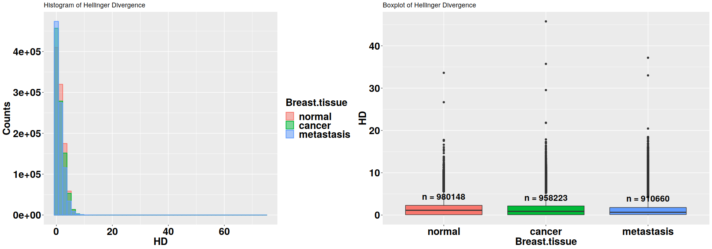
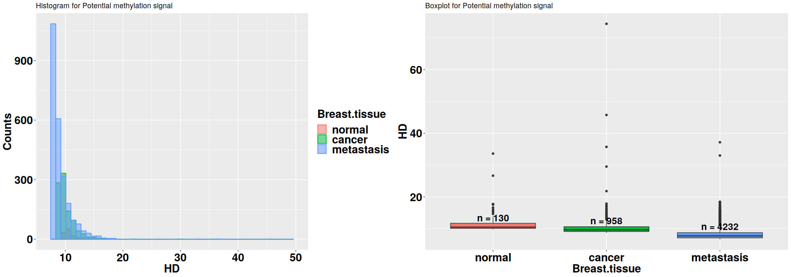
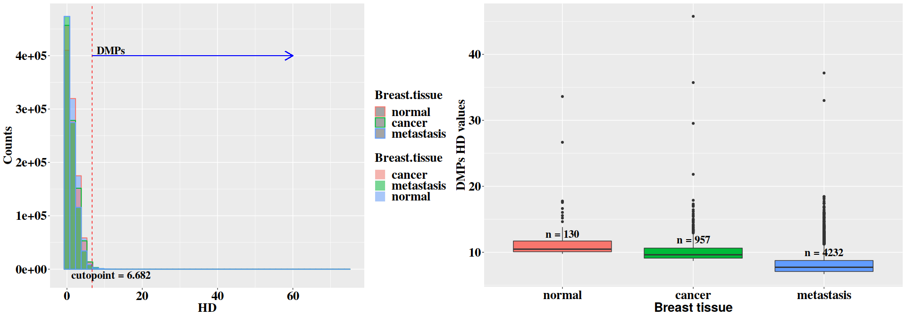
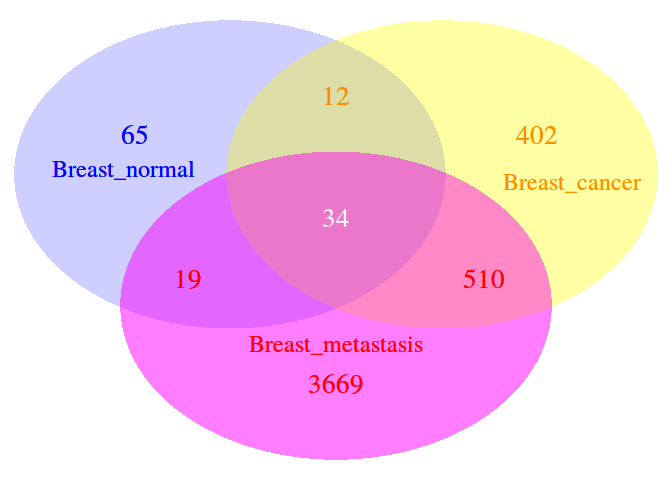
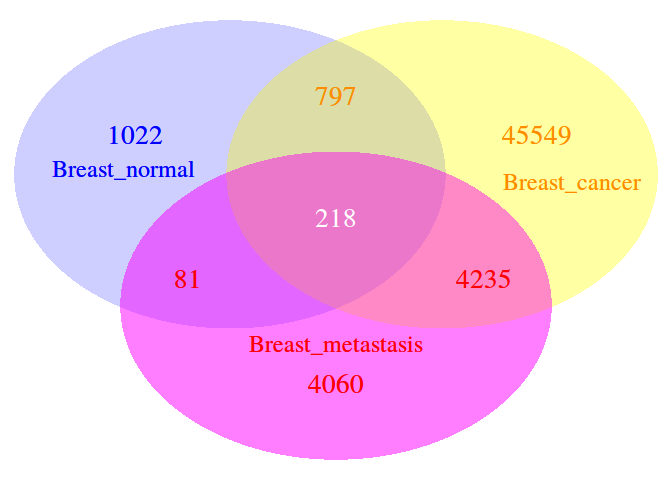

<style type="text/css">

body{ /* Normal  */
      font-size: 18px;
      font-family: "Times New Roman", Times, serif;
      text-align: justify
  }
td {  /* Table  */
  font-size: 8px;
}

h1.title {
  font-size: 38px;
  font-family: "Times New Roman", Times, serif;
  color: DarkRed;
  .subTitle {
  font-size: 24px;
  font-family: "Times New Roman", Times, serif;
  color: DarkRed;
  }
}

h1 { /* Header 1 */
  font-size: 28px;
  font-family: "Times New Roman", Times, serif;
  color: DarkBlue;
}
h2 { /* Header 2 */
    font-size: 22px;
    color: DarkBlue;
    font-family: "Times New Roman", Times, serif;
}
h3 { /* Header 3 */
   font-size: 18px;
   color: DarkBlue;
   font-family: "Times New Roman", Times, serif;
}
code.r{ /* Code block */
    font-size: 12px;
}
pre { /* Code block - determines code spacing between lines */
    font-size: 14px;
}
</style>


# [Methyl-IT](https://github.com/genomaths/MethylIT)
MethylIT is an R package for methylome analysis based on information
thermodynamics and signal detection. The information thermodynamics-based
approach is postulated to provide greater sensitivity for resolving true signal
from the thermodynamic background within the methylome [@Sanchez2016]. Because
the biological signal created within the dynamic methylome environment
characteristic of plants is not free from background noise, the approach,
designated MethylIT, includes the application of signal detection theory
[@Greiner2000; @Carter2016; @Harpaz2013; @Kruspe2017]. A basic requirement for
the application of signal detection is a probability distribution of the
background noise. Probability distribution, as a Weibull distribution or gamma
distribution models, can be deduced on a statistical mechanical/thermodynamics
basis for DNA methylation induced by thermal fluctuations [@Sanchez2016].
Assuming that this background methylation variation is consistent with a Poisson
process, it can be distinguished from variation associated with methylation
regulatory machinery, which is non-independent for all genomic regions
[@Sanchez2016]. An information-theoretic divergence to express the variation in
methylation induced by background thermal fluctuations will follow a Weibull
distribution model, provided that it is proportional to minimum energy
dissipated per bit of information from methylation change.

Herein, we provide an example of MethylIT application to the analysis of breast
cancer methylomes. Due to the size of human methylome the current example only
covers the analysis of chromosome 13. A full description of MethylIT
application of methylome analysis in plants is given in the manuscript
[@Sanchez2018].

The R packages required in this example are:

```r
library(MethylIT)
library(ggplot2) # graphic
library(reshape2) # To reshape the data frame
library(grid) # For multiple plots
library(gridExtra) # For multiple plots
library(VennDiagram) 
library(rtracklayer) # To import gene annotation
```

# Available datasets and reading
Methylome datasets of whole-genome bisulfite sequencing (WGBS) are available
at Gene Expression Omnibus (GEO DataSets). For the current example, datasets
from breast tissues (normal and cancer) and embryonic stem cells will be
downloaded from GEO. The data set are downloaded providing the GEO accession
numbers for each data set to the function 'getGEOSuppFiles' (for details type
?getGEOSuppFiles in the R console).


```r
# Embryonic stem cells datasets
esc.files = getGEOSuppFiles(GEO = c("GSM2041690", "GSM2041691", "GSM2041692"),
                            verbose = FALSE)
# Breast tissues (normal, cancer, metastasis)
cancer.files = getGEOSuppFiles(GEO = c("GSM1279517", "GSM1279514",
                                       "GSM1279513"), verbose = FALSE)
```

The file path and name of each downloaded dataset is found in the output
variables 'esc.files' and 'cancer.files'.

## _Reading datasets_
Datasets for our example can be read with function [readCounts2GRangesList](https://genomaths.github.io/MethylIT_HTML_Manual/readCounts2GRangesList.html).
To specify the reading of only chromosome 13, we can specify the parameter
'chromosomes = "Chr13"'. The symbol chromosome 13, in this case "Chr13", must
be consistent with the annotation provided in the given GEO dataset. Each file
is wholly read with the setting 'chromosomes = "Chr13"' and then the GRanges
are built only with chromosome 13, which could be time consuming. However,
users working on Linux OS can specify the reading of specific lines from each
file by using regular expressions. For example, if only chromosomes 1 and 3 are
required, then we can set chromosomes = NULL (default) and 'chromosome.pattern
= "^Chr[1,3]"'. This will read all the lines in the downloaded files starting
with the words "Chr1" or "Chr3". If we are interested in chromosomes 1 and 2,
then we can set 'chromosome.pattern = "^Chr[1-2]"'. If all the chromosomes are
required, then set chromosomes = NULL and chromosome.pattern = NULL (default).


```r
# Embryonic stem cells datasets
ref = readCounts2GRangesList(filenames = esc.files,  
                             sample.id = c("ESC1","ESC2", "ESC3"),
                             columns = c(seqnames = 1, start = 2,
                                         mC = 4, uC = 5), pattern = "^chr13",
                             remove = TRUE, verbose = FALSE)
# Breast tissues (normal, cancer, metastasis)
LR = readCounts2GRangesList(filenames = cancer.files,
                            sample.id = c("Breast_normal", "Breast_cancer",
                                          "Breast_metastasis"),
                            columns = c(seqnames = 1, start = 2,
                                         mC = 3, uC = 4),
                            remove = TRUE, pattern = "^13",
                            chromosome.names = "chr13", verbose = FALSE)
```


In the metacolumn of the last GRanges object, mC and uC stand for the
methylated and unmethylated read counts, respectively. Notice that option 
'remove = TRUE' remove the decompressed files (default: FALSE, see 
?readCounts2GRangesList for more details about this function).

# The reference individual
Any two objects located in a space can be compared if, and only if, there is a
reference point (a coordinate system) in the space and a metric. Usually, in
our daily 3D experience, our brain automatically sets up the origin of
coordinates equal to zero. The differences found in the comparison depend on
the reference used to perform the measurements and from the metric system. The
space where the objects are located (or the set of objects) together with the
metric is called metric space.

To evaluate the methylation differences between individuals from control and
treatment we introduce a metric in the bidimensional space of methylation
levels $P_i = (p_i, 1-p_i)$. Vectors $P_i$ provide a measurement of the
uncertainty of methylation levels. However, to perform the comparison between
the uncertainty of methylation levels from each group of individuals, control
$(c)$ and treatment $(t)$, we should estimate the uncertainty variation with
respect to the same individual reference on the mentioned metric space. The
reason to measure the uncertainty variation with respect to the same reference
resides in that even sibling individuals follow an independent ontogenetic
development. This a consequence of the "omnipresent" action of the second law
of thermodynamics in living organisms. In the current example, we will create
the reference individual by pooling the methylation counts from the embryonic
stem cells.

It should be noticed that the results are sensitive to the reference used. The
statistics mean, median, or sum of the read counts at each cytosine site of
some control samples can be used to create a virtual reference sample. A virtual 
reference individual can be built with function [poolFromGRlist](https://genomaths.github.io/MethylIT_HTML_Manual/poolFromGRlist.html).
It is up to the user whether to apply the 'row sum', 'row mean' or 'row median' of
methylated and unmethylated read counts at each cytosine site across
individuals. Notice that when "*mean*" is selected the virtual reference individual
is the group centroid, which play a fundamental role in multivariate statistic.


```r
Ref = poolFromGRlist(ref, stat = "mean", num.cores = 6L, verbose = FALSE)

Ref
```

```
## GRanges object with 1560637 ranges and 2 metadata columns:
##             seqnames                 ranges strand |        mC        uC
##                <Rle>              <IRanges>  <Rle> | <numeric> <numeric>
##         [1]    chr13   [19020631, 19020631]      * |         1         1
##         [2]    chr13   [19020633, 19020633]      * |         2         2
##         [3]    chr13   [19020642, 19020642]      * |         1         1
##         [4]    chr13   [19020643, 19020643]      * |         2         2
##         [5]    chr13   [19020679, 19020679]      * |         1         1
##         ...      ...                    ...    ... .       ...       ...
##   [1560633]    chr13 [115108993, 115108993]      * |         1         3
##   [1560634]    chr13 [115109022, 115109022]      * |         1         1
##   [1560635]    chr13 [115109023, 115109023]      * |         3         4
##   [1560636]    chr13 [115109523, 115109523]      * |         2         2
##   [1560637]    chr13 [115109524, 115109524]      * |         1         1
##   -------
##   seqinfo: 1 sequence from an unspecified genome; no seqlengths
```

Only direct lab experiments can reveal whether differences detected with
distinct references outside the experimental conditions for control and
treatment groups are real. The best reference would be estimated using a subset
of individuals from control group. Such a reference will contibute to remove
the intragroup variation, in control and in treatment groups, induced by
enviromental changes external to or not contralled by the experimental
conditions.

Methylation analysis for each cystosine position is frequently performed in the
bidimensional space of $(methylated, unmethylated)$ read counts. Frequently,
Fisher test is applied to a single cytosine position, under the null hypothesis
that the proportions
$p_{ct}=methylated_{ct}/(methylated_{ct}+unmethylated_{ct})$ and
$p_{tt}=methylated_{tt}/(methylated_{tt}+unmethylated_{tt})$ are the same for
control and treatment, respectively. In this case, the implicit reference point
for the counts at every cytosine positions is 
$(methylated = 0,unmethylated = 0)$, which corresponds to the point 
$P_i = (0, 1)$.

In our case, the Hellinger divergence (the metric used, here) of each
individual in respect to the reference is the variable to test in place of
$(methylated, unmethylated)$ read counts or the methylation levels
$P_i = (p_i, 1-p_i)$.

The use of references is restricted by the thermodynamics basis of the the
theory. The current information-thermodynamics based approach is supported on
the following postulate:

  *"High changes of Hellinger divergences are less frequent than low changes,
  provided that the divergence is proportional to the amount of energy required
  to process one bit of information in methylation system"*.

The last postulate acknowledges the action of the second law of thermodynamics
on the biomolecular methylation system. For the methylation system, it implies
that the frequencies of the information divergences between methylation levels
must be proportional to a Boltzmann factor (see supplementary information from
reference [@Sanchez2016]). In other words, the frequencies of information
divergences values should follow a trend proportional to an exponential decay.
If we do not observe such a behaviour, then either the reference is too far
from experimental condition or we are dealing with an extreme situation where
the methylation machinery in the cell is disfunctional. The last situation is
found, for example, in the silencing mutation at the gene of
cytosine-DNA-methyltransferase in Arabidopsis *thaliana*. Methylation of
5-methylcytosine at CpG dinucleotides is maintained by MET1 in plants.

In our current example, the embryonic stem cells reference is far from the
breast tissue samples and this could affect the nonlinear fit to a Weibull
distribution (see below). To illustrate the effect of the reference on the
analysis, a new reference will be built by setting:


```r
Ref0 = Ref
Ref0$uC <- 0
```
The reason for the above replacement is that natural methylation changes
(Ref$mC) obey the second law of thermodynamics, and we do not want to
arbitrarily change the number of methylated read counts. 'mC' carries
information linked to the amount of energy expended in the tissue associated
with concrete methylation changes. However, 'uC' is not linked to any energy
expended by the methylation machinery in the cells. In the bidimensional space
$P_i = (p_i, 1-p_i)$, reference *Ref0* corresponds to the point $P_i = (1, 0)$
at each cytosine site $i$, i.e., the value of methylation level at every
cytosine site in reference *Ref0* is 1. The analyses with respect to both
individual references, *Ref* and *Ref0*, will be performed in the downstream
steps.

# Hellinger divergence estimation
To perform the comparison between the uncertainty of methylation levels
from each group of individuals, control $(c)$ and treatment $(t)$, the
divergence between the  methylation levels of each individual is estimated with
respect to the same reference on the metric space formed by the vector set 
$P_i = (p_i, 1-p_i)$ and the Hellinger divergence $H$. Basically, the 
information divergence between the methylation levels of an individual $j$ and
reference sample $r$ is estimated according to the Hellinger divergence given 
by the  formula: 
$$H(\hat p_{ij},\hat p_{ir}) = w_i[(\sqrt{\hat p_{ij}} - \sqrt{\hat
p_{ir}})^2+(\sqrt{1-\hat p_{ij}} - \sqrt{1-\hat p_{ir}})^2]$$ where 
$w_i = 2 \frac{m_{ij} m_{ir}}{m_{ij} + m_{ir}}$, 
$m_{ij} = {n_i}^{mC_j}+{n_i}^{uC_j}+1$, $m_{ir} = {n_i}^{mC_r}+{n_i}^{uC_r}+1$ 
and $j \in {\{c,t}\}$. This equation for Hellinger divergence is given in
reference [@Basu2010], but other information theoretical divergences can be
used as well. Next, the information divergence for control (Breast_normal) and
treatment (Breast_cancer and Breast_metastasis) samples are estimated with
respect to the reference virtual individual. A Bayesian correction of counts
can be selected or not. In a Bayesian framework, methylated read counts are
modeled by a beta-binomial distribution, which accounts for both the
biological and sampling variations [@Hebestreit2013; @Robinson2014;
@Dolzhenko2014]. In our case we adopted the Bayesian approach suggested in
reference [@Baldi2001] (Chapter 3). In a Bayesian framework with uniform
priors, the methylation level can be defined as: $p = (mC + 1)/(mC + uC + 2)$. 

However, the most natural statistical model for replicated BS-seq DNA
methylation measurements is beta-binomial (the beta distribution is a prior
conjugate of binomial distribution). We consider the parameter $p$ (methylation
level) in the binomial distribution as randomly drawn from a beta distribution.
The hyper-parameters $\alpha$ and $\beta$ from the beta-binomial distribution
are interpreted as pseudo-counts. The information divergence is estimated here
using the function [estimateDivergence](https://genomaths.github.io/MethylIT_HTML_Manual/estimateDivergence.html):


```r
HD = estimateDivergence(ref = Ref, indiv = LR, Bayesian = TRUE,  
                        min.coverage = 5, high.coverage = 300, 
                        percentile = 0.999, num.cores = 6L, tasks = 0L,
                        verbose = FALSE)
HD0 = estimateDivergence(ref = Ref0, indiv = LR, Bayesian = TRUE,  
                         min.coverage = 9, high.coverage = 300, 
                         percentile = 0.999, num.cores = 6L, tasks = 0L,
                         verbose = FALSE)
HD$Breast_cancer
```

```
## GRanges object with 987895 ranges and 9 metadata columns:
##            seqnames                 ranges strand |        c1        t1
##               <Rle>              <IRanges>  <Rle> | <numeric> <numeric>
##        [1]    chr13   [19020631, 19020631]      * |         1         1
##        [2]    chr13   [19020633, 19020633]      * |         2         2
##        [3]    chr13   [19020643, 19020643]      * |         2         2
##        [4]    chr13   [19020680, 19020680]      * |         0         1
##        [5]    chr13   [19020687, 19020687]      * |         1         1
##        ...      ...                    ...    ... .       ...       ...
##   [987891]    chr13 [115108788, 115108788]      * |         2         4
##   [987892]    chr13 [115108789, 115108789]      * |         2         2
##   [987893]    chr13 [115108993, 115108993]      * |         1         3
##   [987894]    chr13 [115109023, 115109023]      * |         3         4
##   [987895]    chr13 [115109524, 115109524]      * |         1         1
##                   c2        t2                p1                 p2
##            <numeric> <numeric>         <numeric>          <numeric>
##        [1]        14        24 0.413370663720767  0.375495465916207
##        [2]        14        25 0.442871729587454   0.36633665561778
##        [3]         7        38 0.442871729587454  0.170626940254775
##        [4]         1        43 0.209181014646214  0.043896699394733
##        [5]         0        46 0.413370663720767 0.0212335246596664
##        ...       ...       ...               ...                ...
##   [987891]         0         0  0.33036727060318  0.254902793892838
##   [987892]        27        43 0.442871729587454  0.389164474334267
##   [987893]        72         5 0.272599930600126  0.924313453079455
##   [987894]        56        36 0.405836166223695  0.606598044818736
##   [987895]        31         9 0.413370663720767  0.762392481743825
##                            TV              bay.TV                hdiv
##                     <numeric>           <numeric>           <numeric>
##        [1] -0.131578947368421 -0.0378751978045603 0.00836901839443372
##        [2] -0.141025641025641 -0.0765350739696741  0.0541295473053947
##        [3] -0.344444444444444  -0.272244789332679   0.818120566547519
##        [4] 0.0227272727272727  -0.165284315251481   0.265271064208063
##        [5]               -0.5  -0.392137139061101    1.67587572624957
##        ...                ...                 ...                 ...
##   [987891] -0.333333333333333  -0.075464476710342  0.0120745026788796
##   [987892] -0.114285714285714 -0.0537072552531863  0.0277523179966212
##   [987893]  0.685064935064935   0.651713522479329    4.95063809290373
##   [987894]  0.180124223602485    0.20076187859504   0.600010041025287
##   [987895]              0.275   0.349021818023058   0.729845744260704
##   -------
##   seqinfo: 1 sequence from an unspecified genome; no seqlengths
```

Function 'estimateDivergence' returns a list of GRanges objects with the four 
columns of counts, the information divergence, and additional columns: 

  1. The original matrix of methylated ($c_i$) and unmethylated ($t_i$) read
     counts from control ($i=1$) and treatment ($i=2$) samples.
  2. "p1" and "p2": methylation levels for control and treatment, respectively.
  3. "bay.TV": total variation TV = p2 - p1.
  4. "TV": total variation based on simple counts: $TV=c1/(c1+t1)-c2/(c2+t2)$.
  5. "hdiv": Hellinger divergence.

If Bayesian = TRUE, results are based on the posterior estimations of
methylation levels $p1$ and $p2$. Filtering by coverage is provided at this
step which would be used unless previous filtering by coverage had been
applied. This is a pairwise filtering. Cytosine sites with 'coverage' >
'min.coverage' and 'coverage' < 'percentile' (e.g., 99.9 coverage percentile)
in at least one of the samples are preserved. The coverage percentile used is
the maximum estimated from both samples: reference and individual.

For some GEO datasets only the methylation levels for each cytosine site are
provided. In this case, Hellinger divergence can be estimated as given in
reference [@Sanchez2016]:
$$H(\hat p_{ij},\hat p_{ir}) = (\sqrt{\hat p_{ij}} - \sqrt{\hat
p_{ir}})^2+(\sqrt{1-\hat p_{ij}} - \sqrt{1-\hat p_{ir}})^2$$

## _Histogram and boxplots of divergences estimated in each sample_
First, the data of interest (Hellinger divergences, "hdiv") are selected from
the GRanges objects:

```r
normal = HD$Breast_normal[, "hdiv"]
normal = normal[ normal$hdiv > 0.01 ]
metastasis = HD$Breast_metastasis[, "hdiv"]
metastasis = metastasis[ metastasis$hdiv > 0.01 ]
cancer = HD$Breast_cancer[, "hdiv"]
cancer = cancer[ cancer$hdiv > 0.01 ]
```
Next, a single GRanges object is built from the above set of GRanges objects
using the function [uniqueGRanges](https://genomaths.github.io/MethylIT_HTML_Manual/uniqueGRanges.html). 
Notice that the number of cores to use for parallel computation can be specified.

```r
hd = uniqueGRanges(list(normal, cancer, metastasis), missing = NA,
                   verbose = FALSE, num.cores = 12L)
hd
```

```
## GRanges object with 1015592 ranges and 3 metadata columns:
##             seqnames                 ranges strand |               hdiv
##                <Rle>              <IRanges>  <Rle> |          <numeric>
##         [1]    chr13   [19020631, 19020631]      * |  0.285305034787823
##         [2]    chr13   [19020633, 19020633]      * |  0.806968481642969
##         [3]    chr13   [19020643, 19020643]      * |  0.466515853285301
##         [4]    chr13   [19020680, 19020680]      * |  0.268933638261748
##         [5]    chr13   [19020687, 19020687]      * | 0.0145912580031885
##         ...      ...                    ...    ... .                ...
##   [1015588]    chr13 [115108788, 115108788]      * |               <NA>
##   [1015589]    chr13 [115108789, 115108789]      * |  0.490453538128809
##   [1015590]    chr13 [115108993, 115108993]      * |    4.6055432713229
##   [1015591]    chr13 [115109023, 115109023]      * |   3.67811869870307
##   [1015592]    chr13 [115109524, 115109524]      * |   1.11848682950288
##                         hdiv.1             hdiv.2
##                      <numeric>          <numeric>
##         [1]               <NA>   2.03059776265135
##         [2] 0.0541295473053947   2.84065152216992
##         [3]  0.818120566547519               <NA>
##         [4]  0.265271064208063               <NA>
##         [5]   1.67587572624957  0.826531969073375
##         ...                ...                ...
##   [1015588] 0.0120745026788796 0.0351683423894548
##   [1015589] 0.0277523179966212   2.06686115112413
##   [1015590]   4.95063809290373   5.14891226533106
##   [1015591]  0.600010041025287  0.922570387484644
##   [1015592]  0.729845744260704  0.393160452572587
##   -------
##   seqinfo: 1 sequence from an unspecified genome; no seqlengths
```

Now, the Hellinger divergences estimated for each sample are in a single matrix
on the metacolumn of the GRanges object and we can proceed to build the
histogram and boxplot graphics for these data.

Finally, the data included in the graphic are:

```r
# Define an auxiliar function
fun_length <- function(x){
  return(data.frame(y = median(x) + 4, label = paste0("n = ", length(x))))
}

data <- data.frame(normal = hd$hdiv, cancer = hd$hdiv.1,
                   metastasis = hd$hdiv.2)
data = suppressMessages(melt(data))
colnames(data) <- c("Breast.tissue", "HD")
data = data[data$HD > 0, ]
DataFrame(data)
```

```
## DataFrame with 3046776 rows and 2 columns
##         Breast.tissue         HD
##              <factor>  <numeric>
## 1              normal 0.28530503
## 2              normal 0.80696848
## 3              normal 0.46651585
## 4              normal 0.26893364
## 5              normal 0.01459126
## ...               ...        ...
## 3046772    metastasis 0.03516834
## 3046773    metastasis 2.06686115
## 3046774    metastasis 5.14891227
## 3046775    metastasis 0.92257039
## 3046776    metastasis 0.39316045
```


```r
p1 = ggplot(data, aes(x = HD, fill = Breast.tissue, colour = Breast.tissue)) + 
  geom_histogram(alpha = 0.5, bins = 50, position = "identity", na.rm = TRUE,
                 size = 0.7) + 
  theme(axis.title.x = element_text(face = "bold", size = 20),
        axis.text.x = element_text(face = "bold", size = 20, color = "black",
                                   hjust = 0.5, vjust = 0.75),
        axis.text.y = element_text(face = "bold", size = 20, color = "black"),
        axis.title.y = element_text(face = "bold", size = 20,color = "black"),
        legend.text = element_text(size = 20, face = "bold"),
        legend.title = element_text(size = 20, face = "bold")
        ) +
  ylab( "Counts" ) + 
  ggtitle("Histogram of Hellinger Divergence")

# For visualization purposes HD is limited to the interval 0 to 4
dt = data[ which(data$HD < 50), ] 
p2 = ggplot(dt,aes(x = Breast.tissue, y = HD , fill = Breast.tissue)) + 
  geom_boxplot(na.rm = TRUE) + 
  stat_summary(fun.data = fun_length, geom = "text",
               position = position_dodge(width = 0.9), vjust = 1,
               size = 6, fontface = "bold") +
  theme(axis.title.x = element_text(face = "bold", size = 20),
        axis.text.x = element_text(face = "bold", size = 20, color = "black",
                                   hjust = 0.5, vjust = 0.75),
        axis.text.y = element_text(face = "bold", size = 20, color = "black"),
        axis.title.y = element_text(face = "bold", size = 20,color = "black"),
        legend.position = "none"
        ) +
  ggtitle("Boxplot of Hellinger Divergence")
grid.arrange(p1, p2, ncol = 2)
```

<!-- -->

Except for the tail, most of the methylation changes occurred under the area
covered by the density curve corresponding to the normal breast tissue. This is
theoretically expected. This area is explainable in statistical physical terms
and, theoretically, it should fit a Weibull distribution. The tails regions
cover the methylation changes that, with high probability, are not induced by
thermal fluctuation and are not addressed to stabilize the DNA molecule. These
changes are methylation signal. Professor David J. Miller (Department of
Electrical Engineering, Penn State) proposed modeling the distribution as a
mixed Weibull distribution to simultaneously describe the background
methylation noise and the methylation signal (personal communication, January,
2018). This model approach seems to be supported by the above histogram, but it
must be studied before being incorporated in a future version of Methyl-IT.

# Nonlinear fit of Weibull distribution
A basic requirement for the application of signal detection is the knowledge of
the probability distribution of the background noise. Probability distribution,
as a Weibull distribution model, can be deduced on a statistical
mechanical/thermodynamics basis for DNA methylation induced by thermal
fluctuations [@Sanchez2016]. Assuming that this background methylation
variation is consistent with a Poisson process, it can be distinguished from
variation associated with methylation regulatory machinery, which is
non-independent for all genomic regions [@Sanchez2016]. An
information-theoretic divergence to express the variation in methylation
induced by background thermal fluctuations will follow a Weibull distribution
model, provided that it is proportional to the minimum energy dissipated per
bit of information associated with the methylation change. The nonlinear fit to
a Weibull distribution model is performed by the function
[nonlinearFitDist](https://genomaths.github.io/MethylIT_HTML_Manual/nonlinearFitDist.html).


```r
nlms = nonlinearFitDist(HD, column = 9, num.cores = 3L, verbose = FALSE)
nlms0 = nonlinearFitDist(HD0, column = 9, num.cores = 3L, verbose = FALSE)

nlms # this returns:
```

```
## $Breast_normal
##        Estimate   Std. Error  t value Pr(>|t|))      Adj.R.Square
## shape 0.5543145 0.0002139500 2590.861         0 0.948873244359916
## scale 1.3468977 0.0005372617 2506.968         0                  
##                     rho       R.Cross.val              DEV               AIC
## shape 0.948873142978588 0.975345096178345 4099.05484372979 -2690639.45164462
## scale                                                                       
##                     BIC     COV.shape     COV.scale COV.mu       n
## shape -2690603.97940838  4.577459e-08 -5.917927e-09     NA 1008605
## scale                   -5.917927e-09  2.886501e-07     NA 1008605
## 
## $Breast_cancer
##           Estimate   Std. Error     t value    Pr(>|t|))     Adj.R.Square
## shape 5.391149e-01 1.506168e-04 3579.381429 0.000000e+00 0.96941589951915
## scale 1.134588e+00 3.739751e-04 3033.860064 0.000000e+00                 
## mu    7.607881e-05 1.356645e-05    5.607863 2.048944e-08                 
##                     rho       R.Cross.val              DEV              AIC
## shape 0.969415837601309 0.984822842841821 2409.03055126017 -3139991.5054956
## scale                                                                      
## mu                                                                         
##                     BIC     COV.shape     COV.scale        COV.mu      n
## shape -3139944.29216882  2.268541e-08 -5.369580e-09 -4.699170e-10 987895
## scale                   -5.369580e-09  1.398574e-07 -4.640279e-10 987895
## mu                      -4.699170e-10 -4.640279e-10  1.840486e-10 987895
## 
## $Breast_metastasis
##         Estimate   Std. Error   t value Pr(>|t|))      Adj.R.Square
## shape 0.55596350 1.506398e-04 3690.6809         0 0.977972027557549
## scale 0.92855327 2.711461e-04 3424.5502         0                  
## mu    0.01631553 3.409143e-05  478.5817         0                  
##                     rho      R.Cross.val              DEV               AIC
## shape 0.977971980615213 0.98906419020184 1647.99283323508 -3291231.66890221
## scale                                                                      
## mu                                                                         
##                  BIC     COV.shape     COV.scale        COV.mu      n
## shape -3291184.66069  2.269235e-08 -1.522434e-10 -2.562546e-09 938514
## scale                -1.522434e-10  7.352018e-08 -2.497534e-09 938514
## mu                   -2.562546e-09 -2.497534e-09  1.162226e-09 938514
## 
## attr(,"class")
## [1] "ProbDistrList" "list"
```
Cross-validations for the nonlinear regressions (R.Cross.val) were performed as
described in reference [@Stevens2009]. In addition, Stein's formula for
adjusted R squared ($\rho$) was used as an estimator of the average
cross-validation predictive power [@Stevens2009].

The goodness-of-fit of Weibull to the HD0 (*Ref0*) data is better than to HD
(*Ref*):

```r
nlms0
```

```
## $Breast_normal
##        Estimate   Std. Error   t value Pr(>|t|))      Adj.R.Square
## shape 0.8294116 0.0001082846  7659.556         0 0.995937143067973
## scale 0.3103328 0.0000296877 10453.243         0                  
##                     rho      R.Cross.val              DEV               AIC
## shape 0.995937132223697 0.99830522736976 253.748299340483 -3860960.92341557
## scale                                                                      
##                     BIC     COV.shape     COV.scale COV.mu      n
## shape -3860926.34268738  1.172554e-08 -7.197877e-10     NA 749311
## scale                   -7.197877e-10  8.813597e-10     NA 749311
## 
## $Breast_cancer
##         Estimate   Std. Error  t value Pr(>|t|))      Adj.R.Square
## shape 0.65808523 1.592997e-04 4131.114         0 0.990007423933119
## scale 0.71350113 1.551868e-04 4597.693         0                  
## mu    0.01231425 3.325003e-05  370.353         0                  
##                     rho       R.Cross.val              DEV               AIC
## shape 0.990007395583978 0.995153440585066 587.148032395742 -2998041.98350013
## scale                                                                       
## mu                                                                          
##                     BIC     COV.shape     COV.scale        COV.mu      n
## shape -2997996.11987504  2.537640e-08 -3.720161e-09 -2.704483e-09 704967
## scale                   -3.720161e-09  2.408294e-08 -1.475318e-09 704967
## mu                      -2.704483e-09 -1.475318e-09  1.105565e-09 704967
## 
## $Breast_metastasis
##          Estimate   Std. Error   t value Pr(>|t|))     Adj.R.Square
## shape 0.590229316 1.198288e-04 4925.6057         0 0.99130928757275
## scale 1.103193068 2.464984e-04 4475.4572         0                 
## mu    0.006755526 2.520266e-05  268.0482         0                 
##                     rho       R.Cross.val              DEV               AIC
## shape 0.991309259423371 0.995659555706653 447.581035974421 -2711720.97325685
## scale                                                                       
## mu                                                                          
##                     BIC     COV.shape     COV.scale        COV.mu      n
## shape -2711675.63969437  1.435894e-08 -4.500865e-09 -1.129274e-09 617473
## scale                   -4.500865e-09  6.076146e-08 -1.140726e-09 617473
## mu                      -1.129274e-09 -1.140726e-09  6.351740e-10 617473
## 
## attr(,"class")
## [1] "ProbDistrList" "list"
```
The goodness-of-fit indicators suggest that the fit to Weibull distribution
model for *Ref0* is better than for *Ref*.

# Signal detection
The information thermodynamics-based approach is postulated to provide greater
sensitivity for resolving true signal from the thermodynamic background within
the methylome [@Sanchez2016]. Because the biological signal created within the
dynamic methylome environment characteristic of plants is not free from
background noise, the approach, designated Methyl-IT, includes the application
of signal detection theory [@Greiner2000; @Carter2016; @Harpaz2013;
@Kruspe2017]. Signal detection is a critical step to increase sensitivity and
resolution of methylation signal by reducing the signal-to-noise ratio and
objectively controlling the false positive rate and prediction accuracy/risk.

## _Potential methylation signal_
The first estimation in our signal detection step is the identification of the
cytosine sites carrying potential methylation signal $PS$. The methylation
regulatory signal does not hold Weibull distribution and, consequently, for a
given level of significance $\alpha$ (Type I error probability, e.g. 
$\alpha = 0.05$), cytosine positions $k$ with information divergence 
$H_k >= H_{\alpha = 0.05}$ can be selected as sites carrying potential signals
$PS$. The value of $\alpha$ can be specified. For example, potential signals
with $H_k > H_{\alpha = 0.01}$ can be selected. For each sample, cytosine sites
are selected based on the corresponding fitted Weibull distribution model
estimated in the previous step. Additionally, since cytosine with 
$|TV_{d_k}| < 0.1$ are the most abundant sites, depending on the sample 
(experiment), cytosine positions $k$ with $H_k >= H_{\alpha = 0.05}$ and 
$|TV_{d_k}| < 0.1$ can be observed. To prevent the last situation we can select the
$PS$ with the additional constraint $|TV_{d_k}| > TV_0$, where $TV_0$ ('tv.cut') is
a user specified value. The $PS$ is detected with the function 
[getPotentialDIMP](https://genomaths.github.io/MethylIT_HTML_Manual/getPotentialDIMP.html):


```r
PS = getPotentialDIMP(LR = HD, nlms = nlms, div.col = 9, alpha = 0.05,
                      tv.col = 7, tv.cut = 0.4)
PS0 = getPotentialDIMP(LR = HD0, nlms = nlms0, div.col = 9, alpha = 0.05,
                       tv.col = 7, tv.cut = 0.4)

PS$Breast_cancer
```

```
## GRanges object with 958 ranges and 10 metadata columns:
##         seqnames                 ranges strand |        c1        t1        c2
##            <Rle>              <IRanges>  <Rle> | <numeric> <numeric> <numeric>
##     [1]    chr13   [20137885, 20137885]      * |         7         8        31
##     [2]    chr13   [20267416, 20267416]      * |         6         6        57
##     [3]    chr13   [20279401, 20279401]      * |         8         8        33
##     [4]    chr13   [20285268, 20285268]      * |         0         5        30
##     [5]    chr13   [20680750, 20680750]      * |         5         6        53
##     ...      ...                    ...    ... .       ...       ...       ...
##   [954]    chr13 [114995714, 114995714]      * |         2         6       104
##   [955]    chr13 [114995719, 114995719]      * |         1         6        98
##   [956]    chr13 [115003506, 115003506]      * |         0         4        89
##   [957]    chr13 [115049352, 115049352]      * |         5         6        45
##   [958]    chr13 [115090019, 115090019]      * |         3         6        77
##                t2                 p1                p2                TV
##         <numeric>          <numeric>         <numeric>         <numeric>
##     [1]         0   0.45048218742099 0.970328544095088 0.533333333333333
##     [2]         0  0.475815388309824 0.983404482207982               0.5
##     [3]         0  0.481227946148085 0.972024139204215               0.5
##     [4]         1 0.0874396287267155  0.94002393396164 0.967741935483871
##     [5]         0  0.435095578441169  0.98219749770619 0.545454545454545
##     ...       ...                ...               ...               ...
##   [954]         3  0.263443639719927 0.963493855019361  0.72196261682243
##   [955]         7  0.180432322273311 0.925427707571774 0.790476190476191
##   [956]         2  0.102328131612797 0.967965998825198 0.978021978021978
##   [957]         0  0.435095578441169 0.979167173630546 0.545454545454545
##   [958]         1  0.331185648084296  0.97526063050039 0.653846153846154
##                    bay.TV             hdiv              wprob
##                 <numeric>        <numeric>          <numeric>
##     [1] 0.519846356674098 9.00956640068852 0.0470830382348148
##     [2] 0.507589093898158 9.45940418698377 0.0434052984126335
##     [3] 0.490796193056131  8.8670225410283 0.0483310172407142
##     [4] 0.852584305234925 9.68800576922036 0.0416763412138236
##     [5] 0.547101919265021 9.66096829306787 0.0418762128129621
##     ...               ...              ...                ...
##   [954] 0.700050215299434  11.039595608022 0.0330533750529325
##   [955] 0.744995385298462 10.2400645328768 0.0378471637588105
##   [956] 0.865637867212401 9.78238187227201 0.0409880920099275
##   [957] 0.544071595189377 9.09110832004754 0.0463876553278191
##   [958] 0.644074982416095  10.759779809129 0.0346393684931494
##   -------
##   seqinfo: 1 sequence from an unspecified genome; no seqlengths
```

Notice that the total variation distance $TV_d=|TV|$ is an information
divergence as well and it can be used in place of Hellinger divergence
[@Sanchez2016]. The set of vectors $P_i = (p_i, 1-p_i)$ and distance function
$TV_d$ integrate a metric space. In particular, after takes the Manhattan
distance between healthy individuals and patients methylation levels we have:
$$M_d(p_{ij}, p_{ir})=\frac{1}{2}(|\hat p_{ij} - \hat p_{ir}| + |(1-\hat p_{ij}) - (1-\hat
p_{ir})|)=|\hat p_{ij} - \hat p_{ir}|=TV_d(p_{ij}, p_{ir})$$. 

That is, the absolute difference of methylation levels is a particular case of
Manhattan distance, which is named total variation distance $TV_d$. The
quantitative effect of the vector components $1-\hat p_{ij}$ and $1-\hat p_{ir}$
(in our case, the effect of unmethylated read counts) is not present in $TV_d$ as
in $H(\hat p_{ij},\hat p_{ir})$.

## _Histogram and boxplots of methylation potential signals_
As before, a single GRanges object is built from the above set GRanges objects
using the function [uniqueGRanges](https://genomaths.github.io/MethylIT_HTML_Manual/uniqueGRanges.html),
and the Hellinger divergences of the cytosine sites carrying $PS$ (for each
sample) are located in a single matrix on the metacolumn of the GRanges object.


```r
ps = uniqueGRanges(PS, missing = NA, verbose = FALSE, num.cores = 12L)
dat = data.frame(normal = ps$hdiv, cancer = ps$hdiv.1, metastasis = ps$hdiv.2)
dat = suppressMessages(melt(dat))
colnames(dat) <- c("Breast.tissue", "HD")
head(dat)
```

```
##   Breast.tissue HD
## 1        normal NA
## 2        normal NA
## 3        normal NA
## 4        normal NA
## 5        normal NA
## 6        normal NA
```

```r
p1 = ggplot(dat, aes(x = HD, fill = Breast.tissue, colour = Breast.tissue)) + 
  geom_histogram(alpha = 0.5, bins = 50, position = "identity", na.rm = TRUE,
                 size = 0.7)  + ylab("Counts") + xlim(7,50) +
theme(axis.title.x = element_text(face = "bold", size = 20),
        axis.text.x = element_text(face = "bold", size = 20, color = "black",
                                   hjust = 0.5, vjust = 0.75),
        axis.text.y = element_text(face = "bold", size = 20, color = "black"),
        axis.title.y = element_text(face = "bold", size = 20,color = "black"),
        legend.text = element_text(size = 20, face = "bold"),
        legend.title = element_text(size = 20, face = "bold")
        ) +
    ggtitle("Histogram for Potential methylation signal")

p2 = ggplot(dat,aes(x = Breast.tissue, y = HD , fill = Breast.tissue)) +
  geom_boxplot(na.rm = TRUE) +
  stat_summary(fun.data = fun_length, geom = "text", na.rm = TRUE, 
               position = position_dodge(width = 0.9), vjust = 1,
               size = 6, fontface = "bold") +
  theme(axis.title.x = element_text(face = "bold", size = 20),
        axis.text.x = element_text(face = "bold", size = 20, color = "black",
                                   hjust = 0.5, vjust = 0.75),
        axis.text.y = element_text(face = "bold", size = 20, color = "black"),
        axis.title.y = element_text(face = "bold", size = 20,color = "black"),
        legend.position = "none"
        ) +
      ggtitle("Boxplot for Potential methylation signal")

grid.arrange(p1, p2, ncol = 2)
```

<!-- -->

# Cutpoint estimation
Laws of statistical physics can account for background methylation, a response
to thermal fluctuations that presumably functions in DNA stability
[@Sanchez2016]. True signal is detected based on the optimal cutpoint
[@lopez2014], which can be estimated from the area under the curve (AUC) of a
receiver operating characteristic (ROC) curve built from a logistic regression
performed with the potential signals from controls and treatments. The ROC AUC
is equivalent to the probability that a randomly-chosen positive instance is
ranked more highly than a randomly-chosen negative instance [@Fawcett2005]. In
the current context, the AUC is equivalent to the probability to distinguish a
randomly-chosen methylation regulatory signal induced by the treatment from a
randomly-chosen signal in the control.

The need for the application of (what is now known as) signal detection in
cancer research was pointed out by Youden in the midst of the last century
[@Youden1950]. In the next example, the simple cutpoint estimation available in
Methyl-IT is based on the aplication of [Youden
index](https://en.wikipedia.org/wiki/Youden%27s_J_statistic) [@Youden1950].
Although cutpoints are estimated for a single variable, the classification
performance can be evaluated for several variables and appliying different model
classifiers. A optimal cutpoint distinguishs disease stages from healthy
indiviadual. The performance of this classification is given in the ouput of
function
[estimateCutPoint](https://genomaths.github.io/MethylIT_HTML_Manual/estimateCutPoint.html).
A model classifier can be requested for further predicitons and its
classification performance is also provided. Below, the selected model
classifier is a quadratic discriminant analysis (QDA) (*classifier1* = "qda",
*clas.perf* = TRUE). Four predictor variables are available: the Hellinger
divergence of methylation levels (*hdiv*), total variation distance (*TV*,
absolute difference of methylation levels), relative position of cytosine site
in the chromosome (*pos*), and the logarithm base two of the probability to
obseve a Hellinger divergence value $H$ greater than the critical value
$H_{\alpha = 0.05}$ (values given as probabilities in object PS, *wprob*). 

Notice that the cutpoint can be estimated for any of the two currently available
information divergences: *Hellinger divergence* (*div.col* = 9) or the *total*
*variation distance* (*div.col* = 7).


```r
cutpoint = estimateCutPoint(LR = PS, control.names = "Breast_normal", 
                             treatment.names = c("Breast_cancer", 
                                                 "Breast_metastasis"),
                             classifier1 = "qda", simple = TRUE,
                             column = c(hdiv = TRUE, TV = TRUE, 
                                        wprob = TRUE, pos = TRUE),
                             div.col = 7, clas.perf = TRUE)
cutpoint
```

```
## Cutpoint estimation with 'Youden Index' 
## Simple cutpoint estimation 
## Cutpoint = 0.84314 
## 
## Cytosine sites from treatment have divergence values >= 0.84314 
## 
## The accessible objects in the output list are: 
##                     Length Class           Mode     
## cutpoint             1     -none-          numeric  
## testSetPerformance   6     confusionMatrix list     
## testSetModel.FDR     1     -none-          numeric  
## model               10     qdaDMP          list     
## modelConfMatrix      6     confusionMatrix list     
## initModel            1     -none-          character
## postProbCut          1     -none-          logical  
## classifier           1     -none-          character
## statistic            1     -none-          logical  
## optStatVal           1     -none-          logical  
## initModelConfMatrix  6     confusionMatrix list
```

In the current case, the classification based on *Youden index* and based only 
on $TV_d$ is not good. The specificity is 0. That is, this model fails in to 
properly distinguish healthy individuals from patients:  

```r
cutpoint$initModelConfMatrix
```

```
## Confusion Matrix and Statistics
## 
##           Reference
## Prediction   CT   TT
##         CT    0    0
##         TT  130 5190
##                                           
##                Accuracy : 0.9756          
##                  95% CI : (0.9711, 0.9795)
##     No Information Rate : 0.9756          
##     P-Value [Acc > NIR] : 0.5233          
##                                           
##                   Kappa : 0               
##  Mcnemar's Test P-Value : <2e-16          
##                                           
##             Sensitivity : 1.0000          
##             Specificity : 0.0000          
##          Pos Pred Value : 0.9756          
##          Neg Pred Value :    NaN          
##              Prevalence : 0.9756          
##          Detection Rate : 0.9756          
##    Detection Prevalence : 1.0000          
##       Balanced Accuracy : 0.5000          
##                                           
##        'Positive' Class : TT              
## 
```
However, the request for a QDA model classifier solved the problem. Still the 
cutpoint based on Youden index is used, but QDA model include more information 
about each cytosine site, which improve the classification performance. Below, 
model confusion matrix is requested, which include the whole set of DMPs. The 
model performance in the test set is given at *cutpoint$testSetPerformance*.


```r
cutpoint$modelConfMatrix
```

```
## Confusion Matrix and Statistics
## 
##           Reference
## Prediction   CT   TT
##         CT   16    0
##         TT    7 2879
##                                         
##                Accuracy : 0.9976        
##                  95% CI : (0.995, 0.999)
##     No Information Rate : 0.9921        
##     P-Value [Acc > NIR] : 9.304e-05     
##                                         
##                   Kappa : 0.8193        
##  Mcnemar's Test P-Value : 0.02334       
##                                         
##             Sensitivity : 1.0000        
##             Specificity : 0.6957        
##          Pos Pred Value : 0.9976        
##          Neg Pred Value : 1.0000        
##              Prevalence : 0.9921        
##          Detection Rate : 0.9921        
##    Detection Prevalence : 0.9945        
##       Balanced Accuracy : 0.8478        
##                                         
##        'Positive' Class : TT            
## 
```
## _Searching the optimal cutpoint with model classifiers_

The previous result can be improved requesting a cutpoint search based on QDA
model classifier:


```r
cutpoint = estimateCutPoint(LR = PS, control.names = "Breast_normal", 
                             treatment.names = c("Breast_cancer", 
                                                 "Breast_metastasis"),
                             classifier1 = "qda", simple = FALSE,
                             column = c(hdiv = TRUE, TV = TRUE, 
                                        wprob = TRUE, pos = TRUE),
                             find.cut = TRUE, cut.interval = c(0.5, 0.8), 
                             cut.incr = 0.01, stat = 0, num.cores = 6,
                             div.col = 9, clas.perf = TRUE)
cutpoint
```

```
## Cutpoint estimation with 'qda' classifier 
## Cutpoint search performed using model posterior probabilities 
## 
## Posterior probability used to get the cutpoint = 0.5 
## Optimized statistic: Accuracy = 0.99812 
## Cutpoint = 6.682 
## 
## Cytosine sites with treatment PostProbCut >= 0.5 have a 
## divergence value >= 6.682 
## 
## Model classifier 'qda' 
## 
## The accessible objects in the output list are: 
##                    Length Class           Mode     
## cutpoint            1     -none-          numeric  
## testSetPerformance  6     confusionMatrix list     
## testSetModel.FDR    1     -none-          numeric  
## model              10     qdaDMP          list     
## modelConfMatrix     6     confusionMatrix list     
## initModel           1     -none-          character
## postProbCut         1     -none-          numeric  
## classifier          1     -none-          character
## statistic           1     -none-          character
## optStatVal          1     -none-          numeric
```
The cutpoint $H=6.682$ permitted the detection of more DMPs in both groups: 
control and patients.


```r
cutpoint$modelConfMatrix
```

```
## Confusion Matrix and Statistics
## 
##           Reference
## Prediction   CT   TT
##         CT  124    3
##         TT    6 5186
##                                           
##                Accuracy : 0.9983          
##                  95% CI : (0.9968, 0.9992)
##     No Information Rate : 0.9756          
##     P-Value [Acc > NIR] : <2e-16          
##                                           
##                   Kappa : 0.9641          
##  Mcnemar's Test P-Value : 0.505           
##                                           
##             Sensitivity : 0.9994          
##             Specificity : 0.9538          
##          Pos Pred Value : 0.9988          
##          Neg Pred Value : 0.9764          
##              Prevalence : 0.9756          
##          Detection Rate : 0.9750          
##    Detection Prevalence : 0.9761          
##       Balanced Accuracy : 0.9766          
##                                           
##        'Positive' Class : TT              
## 
```
Similar analysis is applied to the alternative datset PS0:

```r
cutpoint0 = estimateCutPoint(PS0, control.names = "Breast_normal",
                              treatment.names = c("Breast_cancer", 
                                                   "Breast_metastasis"),
                              classifier1 = "qda", simple = FALSE,
                              find.cut = TRUE, cut.interval = c(0.5, 0.8), 
                              cut.incr = 0.01, stat = 0, num.cores = 6,
                              div.col = 9, verbose = FALSE)
cutpoint0
```

```
## Cutpoint estimation with 'qda' classifier 
## Cutpoint search performed using model posterior probabilities 
## 
## Posterior probability used to get the cutpoint = 0.5 
## Optimized statistic: Accuracy = 0.99944 
## Cutpoint = 1.1675 
## 
## Cytosine sites with treatment PostProbCut >= 0.5 have a 
## divergence value >= 1.1675 
## 
## Model classifier 'qda' 
## 
## The accessible objects in the output list are: 
##                    Length Class           Mode     
## cutpoint            1     -none-          numeric  
## testSetPerformance  6     confusionMatrix list     
## testSetModel.FDR    1     -none-          numeric  
## model              10     qdaDMP          list     
## modelConfMatrix     6     confusionMatrix list     
## initModel           1     -none-          character
## postProbCut         1     -none-          numeric  
## classifier          1     -none-          character
## statistic           1     -none-          character
## optStatVal          1     -none-          numeric
```


```r
cutpoint0$modelConfMatrix
```

```
## Confusion Matrix and Statistics
## 
##           Reference
## Prediction    CT    TT
##         CT 29986     0
##         TT    43 59393
##                                           
##                Accuracy : 0.9995          
##                  95% CI : (0.9994, 0.9997)
##     No Information Rate : 0.6642          
##     P-Value [Acc > NIR] : < 2.2e-16       
##                                           
##                   Kappa : 0.9989          
##  Mcnemar's Test P-Value : 1.504e-10       
##                                           
##             Sensitivity : 1.0000          
##             Specificity : 0.9986          
##          Pos Pred Value : 0.9993          
##          Neg Pred Value : 1.0000          
##              Prevalence : 0.6642          
##          Detection Rate : 0.6642          
##    Detection Prevalence : 0.6647          
##       Balanced Accuracy : 0.9993          
##                                           
##        'Positive' Class : TT              
## 
```

# DMPs
Cytosine sites carrying a methylation signal are designated _differentially
informative methylated positions_ (DMPs). The probability that a DMP is not
induced by the treatment is given by the probability of false alarm ($P_{FA}$,
false positive). That is, the biological signal is naturally present in the
control as well as in the treatment. Each DMP is a cytosine position carrying
a significant methylation signal, which may or may not be represented within a
differentially methylated position (DMP) according to Fisher's exact test (or
other current tests). A DMP is a DNA cytosine position with high probability
to be differentially methylated or unmethylated in the treatment with respect
to a given control. Notice that the definition of DMP is not deterministic in
an ordinary sense, but stochastic-deterministic in physico-mathematical terms.

DMPs are selected with the function [selectDIMP](https://genomaths.github.io/MethylIT_HTML_Manual/selectDIMP.html)

```r
DMPs = selectDIMP(PS, div.col = 9, cutpoint = 6.682	)
DMPs0 = selectDIMP(PS0, div.col = 9, cutpoint = 1.1675)
```

## _Histogram and boxplots of DMPs_
The cutpoint detected with the signal detection step is very close (in this
case) to the Hellinger divergence value $H_{\alpha = 0.05}$ estimated for
cancer tissue. The natural methylation regulatory signal is still present in a
patient with cancer and reduced during the metastasis step. This signal is
detected here as a false alarm ($P_{FA}$, false positive)

The list of GRanges with DMPs are integrated into a single GRanges object with 
the matrix of 'hdiv' values on its metacolumn:   

```r
dimp = uniqueGRanges(DMPs, missing = NA, verbose = FALSE, num.cores = 12L)
dat <- data.frame(normal = dimp$hdiv, cancer = dimp$hdiv.1,
                  metastasis = dimp$hdiv.2)
dat = suppressMessages(melt(dat))
colnames(dat) <- c("Breast.tissue", "HD")
dt = dat[ which(dat$HD < 50), ]
cutp = 6.682	
DataFrame(dt)
```

```
## DataFrame with 5319 rows and 2 columns
##      Breast.tissue        HD
##           <factor> <numeric>
## 1           normal 12.409044
## 2           normal 10.338476
## 3           normal 11.985884
## 4           normal  9.765537
## 5           normal 12.059939
## ...            ...       ...
## 5315    metastasis  7.424515
## 5316    metastasis  8.242846
## 5317    metastasis  6.944346
## 5318    metastasis  6.922380
## 5319    metastasis  7.625579
```

The multiplot with the histogram and the boxplot can now built:

```r
p1 = ggplot(data, aes(x = HD, fill = Breast.tissue, colour = Breast.tissue)) +
  geom_histogram(alpha = 0.5, bins = 50, position = "identity", na.rm = TRUE,
                 size = 0.7) + ylab( "Counts" ) +
  geom_vline(xintercept = cutp, color = "red", linetype = "dashed") +
  annotate(geom = "text", x = cutp + 5, y = -11000, fontface = 2, size = 6,
           label = paste0("cutopoint = ", cutp), family = "serif") +
  annotate(geom = "text", x = cutp + 5, y = 4.1e5, label = "DMPs",
           fontface = 2, size = 6, family = "serif") +
  geom_segment(aes(x = cutp, xend = 60, y = 4e5, yend = 4e5),
               arrow = arrow(length = unit(0.5, "cm")), color = "blue") +
  theme(axis.title.x = element_text(face = "bold", size = 20, family = "serif"),
        axis.text.x = element_text(face = "bold", size = 20, color = "black",
                                   hjust = 0.5, vjust = 0.75, family = "serif"),
        axis.text.y = element_text(face = "bold", size = 20, color = "black",
                                   family = "serif"),
        axis.title.y = element_text(face = "bold", size = 20,color = "black",
                                    family = "serif"),
        legend.text = element_text(size = 20, face = "bold", family = "serif"),
        legend.title = element_text(size = 20, face = "bold", family = "serif")
  )

p2 = ggplot(dt,aes(x = Breast.tissue, y = HD , fill = Breast.tissue)) +
  geom_boxplot(na.rm = TRUE) + ylab("DMPs HD values") +
  stat_summary(fun.data = fun_length, geom = "text",
               position = position_dodge(width = 0.9), vjust = 2,
               size = 6, fontface = "bold", family = "serif") +
  xlab("Breast tissue") +
  theme(axis.title.x = element_text(face = "bold", size = 20),
        axis.text.x = element_text(face = "bold", size = 20, color = "black",
                                   hjust = 0.5, vjust = 0.75, family = "serif"),
        axis.text.y = element_text(face = "bold", size = 20, color = "black",
                                   family = "serif"),
        axis.title.y = element_text(face = "bold", size = 20,color = "black",
                                    family = "serif"),
        legend.position = "none"
  )
grid.arrange(p1, p2, ncol = 2)
```

<!-- -->

## _Venn Diagram of DMPs_
The Venn diagram of DMPs reveals that the number cytosine site carrying
methylation signal with a divergence level comparable to that observed in
breast tissues with cancer and metastasis is relatively small (2797 DMPs). The
number of DMPs decreased in the breast tissue with metastasis, but, as shown
in the last boxplot, the intensity of the signal increased.


```r
n12 = length(GenomicRanges::intersect(DMPs$Breast_normal,
                                      DMPs$Breast_cancer))
n13 = length(GenomicRanges::intersect(DMPs$Breast_normal,
                                      DMPs$Breast_metastasis))
n23 = length(GenomicRanges::intersect(DMPs$Breast_cancer,
                                      DMPs$Breast_metastasis))
n123 = length(Reduce(GenomicRanges::intersect, 
                     list(DMPs$Breast_normal, DMPs$Breast_cancer,
                          DMPs$Breast_metastasis)))

grid.newpage()
v = draw.triple.venn(area1 = length(DMPs$Breast_normal),
                     area2 = length(DMPs$Breast_cancer),
                     area3 = length(DMPs$Breast_metastasis),
                     n12 = n12, n23 = n23, n13 = n13, n123 = n123,
                     category = c("Breast_normal", "Breast_cancer", 
                                  "Breast_metastasis"),
                     lty = rep("blank", 3), fill = c("blue", "yellow",
                                                     "magenta"),
                     alpha = c(0.1, 0.2, 0.3), 
                     cat.pos = c(-80, 90, 0),
                     cat.col = c("blue", "darkorange", "red"),
                     cat.dist = c( -0.1, -0.08, -0.26),
                     cex = rep(1.7, 7),
                     cat.cex = c( 1.5, 1.5, 1.5),
                     label.col = c( "blue", "darkorange", "darkorange",
                                    "red", 
                                    "white", "red", "red"),
                     scaled = TRUE)
grid.draw(v)
```

<!-- -->


Notice that natural methylation regulatory signals (not induced by the
treatment) are present in both groups, control and treatment. The signal
detection step permits us to discriminate the "ordinary" signals observed in
the control from those induced by the treatment (a disease in the current
case). In addtion, this diagram reflects a classification of DMPs only based
on the cytosine positions. That is, this Venn diagram cannot tell us whether
DMPs at the same postion can be distinguishable or not. For example, DMPs at
the same positions in control and treatment can happend with different
probabilities estimated from their corresponding fitted Weibull distributions
(see below).

## _Venn Diagram of DMPs for reference Ref0_


```r
DMPs0 = selectDIMP(PS0, div.col = 9, cutpoint = 3.514418)

n12 = length(GenomicRanges::intersect(DMPs0$Breast_normal,
                                      DMPs0$Breast_cancer))
n13 = length(GenomicRanges::intersect(DMPs0$Breast_normal,
                                      DMPs0$Breast_metastasis))
n23 = length(GenomicRanges::intersect(DMPs0$Breast_cancer,
                                      DMPs0$Breast_metastasis))
n123 = length(Reduce(GenomicRanges::intersect, 
                     list(DMPs0$Breast_normal, DMPs0$Breast_cancer,
                          DMPs0$Breast_metastasis)))

grid.newpage()
v = draw.triple.venn(area1 = length(DMPs0$Breast_normal),
                     area2 = length(DMPs0$Breast_cancer),
                     area3 = length(DMPs0$Breast_metastasis),
                     n12 = n12, n23 = n23, n13 = n13, n123 = n123,
                     category = c("Breast_normal", "Breast_cancer", 
                                  "Breast_metastasis"),
                     lty = rep("blank", 3), fill = c("blue", "yellow",
                                                     "magenta"),
                     alpha = c(0.1, 0.2, 0.3), 
                     cat.pos = c(-80, 90, 0),
                     cat.col = c("blue", "darkorange", "red"),
                     cat.dist = c( -0.1, -0.08, -0.26),
                     cex = rep(1.7, 7),
                     cat.cex = c( 1.5, 1.5, 1.5),
                     label.col = c( "blue", "darkorange", "darkorange",
                                    "red", 
                                    "white", "red", "red"),
                     scaled = TRUE)
grid.draw(v)
```

<!-- -->


# Differentially informative methylated genomic regions (DIMRs)
Our degree of confidence in whether DMP counts in both groups of samples,
control and treatment, represent true biological signal was determined in the
signal detection step. To estimate DIMRs, we followed similar steps to those
proposed in Bioconductor R package DESeq2 [@Love2014], but our GLM test looks
for statistical difference between the groups based on gene-body DMP counts
overlapping a given genomic region rather than read counts. The regression
analysis of the generalized linear model (GLM) with logarithmic link was
applied to test the difference between group counts. The fitting algorithmic
approaches provided by 'glm' and 'glm.nb' functions from the R packages stat
and MASS, respectively, were used for Poisson (PR), Quasi-Poisson (QPR) and
Negative Binomial (NBR) linear regression analyses, respectively.

## _Differentially methylated genes (DMGs)_
We shall call DMGs those DIMRs restricted to gene-body regions. DMGs are
detected using function 'countTest'. We used computational steps from DESeq2
packages. In the current case we follow the steps:

```r
# To load human gene annotation 
AG = import(con = paste0("ftp://ftp.ensembl.org/pub/release-91/gff3/",
                         "homo_sapiens/Homo_sapiens.GRCh38.91.gff3.gz"))
genes = AG[ AG$type == "gene", c( "gene_id", "biotype" ) ]
genes = genes[ genes$biotype == "protein_coding", "gene_id" ]
seqlevels(genes, "coarse") <- "13" # To keep a consistent chromosome annotation
seqlevels(genes) <- "chr13"
```

Function [getDIMPatGenes](https://genomaths.github.io/MethylIT_HTML_Manual/getDIMPatGenes.html)
is used to count the number of DMPs at gene-body.
The operation of this function is based on the '*findOverlaps*' function from the
'*GenomicRanges*' Bioconductor R package. The '*findOverlaps*' function has several
critical parameters like, for example, '*maxgap*', '*minoverlap*', and
'*ignore.strand*'. In our function [getDIMPatGenes](https://genomaths.github.io/MethylIT_HTML_Manual/getDIMPatGenes.html), 
except for setting ignore.strand = TRUE and *type = "within"*, we preserve the rest of default
'findOverlaps' parameters. In this case, these are important parameter settings
because the local mechanical effect of methylation changes on a DNA region
where a gene is located is independent of the strand where the gene is encoded.
That is, methylation changes located in any of the two DNA strands inside the
gene-body region will affect the flexibility of the DNA molecule [@Choy2010;
@Severin2011].


```r
DMPsBN = getDIMPatGenes(GR = DMPs$Breast_normal, GENES = genes)
DMPsBC = getDIMPatGenes(GR = DMPs$Breast_cancer, GENES = genes)
DMPsBM = getDIMPatGenes(GR = DMPs$Breast_metastasis, GENES = genes)
```

The number of DMPs on the strand where a gene is encoded is obtained by
setting ignore.strand = FALSE. However, for the current example results will be
the same since the datasets downloaded from GEO do not have strand information.
Next, the above GRanges objects carrying the DMP counts from each sample are
grouped into a single GRanges object. Since we have only one control, to
perform group comparison and to move forward with this example, we duplicated
'Breast_normal' sample. Obviously, the confidence on the results increases with
the number of sample replications per group (in this case, it is only an
illustrative example on how to perform the analysis, since a fair comparison
requires for more than one replicate in the control group).


```r
Genes.DMPs = uniqueGRanges( list(DMPsBN[, 2], DMPsBN[, 2],
                                  DMPsBC[, 2], DMPsBM[, 2]),
                             type = "equal", verbose = FALSE,
                             ignore.strand = TRUE )
colnames( mcols(Genes.DMPs)) <- c("Breast_normal", "Breast_normal1",
                                   "Breast_cancer", "Breast_metastasis")
```

Next, the set of mapped genes are annotated 

```r
GeneID = subsetByOverlaps(genes, Genes.DMPs, type = "equal", 
                          ignore.strand = FALSE)
names( Genes.DMPs ) <- GeneID$gene_id
Genes.DMPs
```

```
## GRanges object with 202 ranges and 4 metadata columns:
##                   seqnames                 ranges strand | Breast_normal
##                      <Rle>              <IRanges>  <Rle> |     <numeric>
##   ENSG00000132958    chr13   [19422877, 19536762]      * |             0
##   ENSG00000196199    chr13   [19633681, 19673459]      * |             1
##   ENSG00000121390    chr13   [19674752, 19783019]      * |             2
##   ENSG00000165474    chr13   [20187470, 20192898]      * |             0
##   ENSG00000165475    chr13   [20403667, 20525857]      * |             1
##               ...      ...                    ...    ... .           ...
##   ENSG00000283199    chr13 [113953705, 113973997]      * |             0
##   ENSG00000185989    chr13 [113977783, 114132611]      * |             1
##   ENSG00000283361    chr13 [114179238, 114223084]      * |             0
##   ENSG00000130177    chr13 [114234887, 114272723]      * |             0
##   ENSG00000169062    chr13 [114281584, 114305817]      * |             0
##                   Breast_normal1 Breast_cancer Breast_metastasis
##                        <numeric>     <numeric>         <numeric>
##   ENSG00000132958              0             0                 2
##   ENSG00000196199              1             0                 1
##   ENSG00000121390              2             0                 6
##   ENSG00000165474              0             0                 1
##   ENSG00000165475              1             0                 5
##               ...            ...           ...               ...
##   ENSG00000283199              0             0                 2
##   ENSG00000185989              1             5                23
##   ENSG00000283361              0             3                10
##   ENSG00000130177              0             0                 3
##   ENSG00000169062              0             2                 4
##   -------
##   seqinfo: 1 sequence from an unspecified genome; no seqlengths
```

Now, we build a 'DESeqDataSet' object using functions DESeq2 package.  

```r
## An experiment design is set.
colData <- data.frame(condition = factor(c("BN","BN","BC","BC")),
                       c("Breast_normal","Breast_normal1",
                         "Breast_cancer","Breast_metastasis"),
                       row.names = 2)
## A RangedGlmDataSet is created
ds <- glmDataSet(GR = Genes.DMPs, colData = colData)
ds
```

```
## RangedGlmDataSet with 202 regions and 4 columns (individuals) with factor levels 'BC' and 'BN' 
## The accessible objects in the dataset are: 
##             Length Class      Mode     
## GR          202    GRanges    S4       
## counts      808    -none-     numeric  
## colData       1    data.frame list     
## sampleNames   4    -none-     character
## levels        2    -none-     character
## optionData    0    -none-     NULL
```

DMG analysis is performed with the function [countTest](https://genomaths.github.io/MethylIT_HTML_Manual/countTest2.html)

```r
DMGs = countTest2(DS = ds, num.cores = 4L, minCountPerIndv = 8, 
                  countFilter = TRUE, maxGrpCV = c(1, 0.5),
                 Minlog2FC = 1, pvalCutOff = 0.05,
                 MVrate = .95, verbose = FALSE)
DMGs
```

```
## GRanges object with 23 ranges and 11 metadata columns:
##                   seqnames                 ranges strand | Breast_normal
##                      <Rle>              <IRanges>  <Rle> |     <numeric>
##   ENSG00000102699    chr13   [24420926, 24512810]      * |             1
##   ENSG00000102755    chr13   [28300344, 28495145]      * |             0
##   ENSG00000133083    chr13   [35768652, 36131306]      * |             0
##   ENSG00000102763    chr13   [41566837, 41961120]      * |             1
##   ENSG00000083635    chr13   [44939249, 44989483]      * |             0
##               ...      ...                    ...    ... .           ...
##   ENSG00000102606    chr13 [111114559, 111305737]      * |             1
##   ENSG00000068650    chr13 [112690329, 112887168]      * |             0
##   ENSG00000126217    chr13 [112894378, 113099739]      * |             0
##   ENSG00000126226    chr13 [113177539, 113208715]      * |             0
##   ENSG00000185989    chr13 [113977783, 114132611]      * |             1
##                   Breast_normal1 Breast_cancer Breast_metastasis    log2FC
##                        <numeric>     <numeric>         <numeric> <numeric>
##   ENSG00000102699              1             3                16 -2.251292
##   ENSG00000102755              0            12                48 -3.433987
##   ENSG00000133083              0             6                30 -2.944439
##   ENSG00000102763              1             2                16 -2.197225
##   ENSG00000083635              0            11                23 -2.890372
##               ...            ...           ...               ...       ...
##   ENSG00000102606              1            12                 9 -2.351375
##   ENSG00000068650              0            59                96 -4.363099
##   ENSG00000126217              0             3                13 -2.197225
##   ENSG00000126226              0             8                 8 -2.197225
##   ENSG00000185989              1             5                23 -2.639057
##                        pvalue          model    adj.pval CT.SignalDensity
##                     <numeric>       <factor>   <numeric>        <numeric>
##   ENSG00000102699 0.015716006   Neg.Binomial 0.021262832     1.033901e-04
##   ENSG00000102755 0.048153952 Neg.Binomial.W 0.048153952     1.540025e-04
##   ENSG00000133083 0.001307324   Neg.Binomial 0.007517111     4.963395e-05
##   ENSG00000102763 0.028707583   Neg.Binomial 0.033013720     2.282619e-05
##   ENSG00000083635 0.028234438 Neg.Binomial.W 0.033013720     3.384095e-04
##               ...         ...            ...         ...              ...
##   ENSG00000102606 0.020571388   QuasiPoisson 0.026285663     5.492235e-05
##   ENSG00000068650 0.006298080 Neg.Binomial.W 0.011142758     3.937208e-04
##   ENSG00000126217 0.009472232   Neg.Binomial 0.014524088     3.895560e-05
##   ENSG00000126226 0.003199549   Neg.Binomial 0.009991691     2.565994e-04
##   ENSG00000185989 0.003984293   Neg.Binomial 0.010114025     9.042234e-05
##                   TT.SignalDensity SignalDensityVariation
##                          <numeric>              <numeric>
##   ENSG00000102699     1.088317e-05          -9.250694e-05
##   ENSG00000102755     0.000000e+00          -1.540025e-04
##   ENSG00000133083     0.000000e+00          -4.963395e-05
##   ENSG00000102763     2.536243e-06          -2.028994e-05
##   ENSG00000083635     0.000000e+00          -3.384095e-04
##               ...              ...                    ...
##   ENSG00000102606     5.230700e-06          -4.969165e-05
##   ENSG00000068650     0.000000e+00          -3.937208e-04
##   ENSG00000126217     0.000000e+00          -3.895560e-05
##   ENSG00000126226     0.000000e+00          -2.565994e-04
##   ENSG00000185989     6.458738e-06          -8.396360e-05
##   -------
##   seqinfo: 1 sequence from an unspecified genome; no seqlengths
```


## _DMGs for reference Ref0_


```r
DMPs0BN = getDIMPatGenes(GR = DMPs0$Breast_normal, GENES = genes)
DMPs0BC = getDIMPatGenes(GR = DMPs0$Breast_cancer, GENES = genes)
DMPs0BM = getDIMPatGenes(GR = DMPs0$Breast_metastasis, GENES = genes)

Genes.DMPs0 = uniqueGRanges( list(DMPs0BN[, 2], DMPs0BN[, 2],
                                   DMPs0BC[, 2], DMPs0BM[, 2]),
                              type = "equal", verbose = FALSE,
                              ignore.strand = TRUE )
colnames( mcols(Genes.DMPs0)) <- c("Breast_normal", "Breast_normal1",
                                    "Breast_cancer", "Breast_metastasis")

GeneID = subsetByOverlaps(genes, Genes.DMPs0, type = "equal", 
                          ignore.strand = FALSE)
names( Genes.DMPs0 ) <- GeneID$gene_id

## An experiment design is set.
colData <- data.frame(condition = factor(c("BN","BN","BC","BC")),
                       c("Breast_normal","Breast_normal1",
                         "Breast_cancer","Breast_metastasis"),
                       row.names = 2)
## A RangedGlmDataSet is created
ds0 <- glmDataSet(GR = Genes.DMPs0, colData = colData)
ds0
```

```
## RangedGlmDataSet with 295 regions and 4 columns (individuals) with factor levels 'BC' and 'BN' 
## The accessible objects in the dataset are: 
##             Length Class      Mode     
## GR           295   GRanges    S4       
## counts      1180   -none-     numeric  
## colData        1   data.frame list     
## sampleNames    4   -none-     character
## levels         2   -none-     character
## optionData     0   -none-     NULL
```

```r
DMGs0 = countTest2(DS = ds0, num.cores = 4L, minCountPerIndv = 8, 
                  countFilter = TRUE, maxGrpCV = c(1, 0.5),
                 Minlog2FC = 1, pvalCutOff = 0.05,
                 MVrate = .95, verbose = FALSE)

DMGs0
```

```
## GRanges object with 63 ranges and 11 metadata columns:
##                   seqnames                 ranges strand | Breast_normal
##                      <Rle>              <IRanges>  <Rle> |     <numeric>
##   ENSG00000132958    chr13   [19422877, 19536762]      * |             2
##   ENSG00000132950    chr13   [19823482, 19863636]      * |             0
##   ENSG00000172458    chr13   [20702127, 20723098]      * |            10
##   ENSG00000132953    chr13   [20777329, 20903048]      * |             2
##   ENSG00000151849    chr13   [24882284, 24922889]      * |             3
##               ...      ...                    ...    ... .           ...
##   ENSG00000150403    chr13 [113490995, 113554590]      * |            10
##   ENSG00000198176    chr13 [113584721, 113641470]      * |            11
##   ENSG00000185974    chr13 [113667155, 113737735]      * |             4
##   ENSG00000184497    chr13 [113759240, 113816995]      * |            10
##   ENSG00000185989    chr13 [113977783, 114132611]      * |            12
##                   Breast_normal1 Breast_cancer Breast_metastasis    log2FC
##                        <numeric>     <numeric>         <numeric> <numeric>
##   ENSG00000132958              2           184                37 -4.011868
##   ENSG00000132950              0            32                 6 -2.995732
##   ENSG00000172458             10             1                 0  1.992430
##   ENSG00000132953              2            33                 7 -2.302585
##   ENSG00000151849              3            12                 9 -1.252763
##               ...            ...           ...               ...       ...
##   ENSG00000150403             10            35                79 -1.740466
##   ENSG00000198176             11            15                58 -1.199417
##   ENSG00000185974              4            17                81 -2.505526
##   ENSG00000184497             10            45                35 -1.386294
##   ENSG00000185989             12            93                62 -1.865371
##                         pvalue          model    adj.pval CT.SignalDensity
##                      <numeric>       <factor>   <numeric>        <numeric>
##   ENSG00000132958  0.035518595 Neg.Binomial.W 0.041438361     9.702685e-04
##   ENSG00000132950  0.001268392   Neg.Binomial 0.003995436     4.731665e-04
##   ENSG00000172458  0.015533410   QuasiPoisson 0.023628043     2.384131e-05
##   ENSG00000132953  0.002364598   Neg.Binomial 0.006771348     1.590837e-04
##   ENSG00000151849  0.028033770   QuasiPoisson 0.036043418     2.585825e-04
##               ...          ...            ...         ...              ...
##   ENSG00000150403 0.0268342905 Neg.Binomial.W 0.035220006     0.0008962828
##   ENSG00000198176 0.0178242956   Neg.Binomial 0.025521151     0.0006431718
##   ENSG00000185974 0.0001592680   Neg.Binomial 0.001114876     0.0006942378
##   ENSG00000184497 0.0030051507 Neg.Binomial.W 0.007244542     0.0006925687
##   ENSG00000185989 0.0004878327 Neg.Binomial.W 0.002048897     0.0005005522
##                   TT.SignalDensity SignalDensityVariation
##                          <numeric>              <numeric>
##   ENSG00000132958     1.756142e-05          -0.0009527071
##   ENSG00000132950     0.000000e+00          -0.0004731665
##   ENSG00000172458     4.768262e-04           0.0004529849
##   ENSG00000132953     1.590837e-05          -0.0001431753
##   ENSG00000151849     7.388071e-05          -0.0001847018
##               ...              ...                    ...
##   ENSG00000150403     1.572426e-04          -0.0007390402
##   ENSG00000198176     1.938326e-04          -0.0004493392
##   ENSG00000185974     5.667248e-05          -0.0006375654
##   ENSG00000184497     1.731422e-04          -0.0005194266
##   ENSG00000185989     7.750486e-05          -0.0004230474
##   -------
##   seqinfo: 1 sequence from an unspecified genome; no seqlengths
```


_**BRCA2, a breast cancer associated risk gene, is found between the DMG**s_


```r
# DMGs0
DMGs0[ grep( "ENSG00000139618", names(DMGs0) ) ]
```

```
## GRanges object with 1 range and 11 metadata columns:
##                   seqnames               ranges strand | Breast_normal
##                      <Rle>            <IRanges>  <Rle> |     <numeric>
##   ENSG00000139618    chr13 [32315474, 32400266]      * |             3
##                   Breast_normal1 Breast_cancer Breast_metastasis    log2FC
##                        <numeric>     <numeric>         <numeric> <numeric>
##   ENSG00000139618              3           125                31 -3.258097
##                       pvalue          model   adj.pval CT.SignalDensity
##                    <numeric>       <factor>  <numeric>        <numeric>
##   ENSG00000139618 0.03526173 Neg.Binomial.W 0.04143836     0.0009198873
##                   TT.SignalDensity SignalDensityVariation
##                          <numeric>              <numeric>
##   ENSG00000139618     3.538028e-05           -0.000884507
##   -------
##   seqinfo: 1 sequence from an unspecified genome; no seqlengths
```

# Monte Carlo Evaluation of the Model Classification Performance
The regulatory methylation signal is an output from a natural process that
continuously takes place across the ontogenetic development of the organism.
Therefore, we expect to see methylation signal in natural, ordinary conditions.
Function 'evaluateDIMPclass' can be used to perform a classification of DMPs
into two classes: DMPS from control and DMPs from treatment samples, as well
as an evaluation of the classification performance (for more details see
[evaluateDIMPclass](https://genomaths.github.io/MethylIT_HTML_Manual/evaluateDIMPclass.html)). 
As a matter of fact this function is called by function [estimateCutPoint](https://genomaths.github.io/MethylIT_HTML_Manual/estimateCutPoint.html).
Additional feature not used before is the possibility to perform Monte Carlo evaluation 
of the model classifier performance. In above split of the sample into two subsets, 
training and test datasets, we would be just lucky getting the right proportion 
that yields the best classification performance. What about is the random split is
repeat 300 times?

The performance of the logistic classifier using reference 'Ref' is:

```r
performance <- evaluateDIMPclass(LR = DMPs, control.names = "Breast_normal",
                              treatment.names = c("Breast_cancer", 
                                                  "Breast_metastasis"),
                              column = c(hdiv = TRUE, TV = TRUE, 
                                         wprob = TRUE, pos = TRUE),
                              classifier = "qda", prop = 0.6, num.boot = 300,
                              output = "mc.val", num.cores = 6L)
performance
```

```
##     Accuracy          Kappa        AccuracyLower    AccuracyUpper   
##  Min.   :0.9939   Min.   :0.8571   Min.   :0.9896   Min.   :0.9967  
##  1st Qu.:0.9977   1st Qu.:0.9493   1st Qu.:0.9945   1st Qu.:0.9992  
##  Median :0.9981   Median :0.9606   Median :0.9952   Median :0.9995  
##  Mean   :0.9981   Mean   :0.9595   Mean   :0.9952   Mean   :0.9994  
##  3rd Qu.:0.9991   3rd Qu.:0.9799   3rd Qu.:0.9966   3rd Qu.:0.9999  
##  Max.   :1.0000   Max.   :1.0000   Max.   :0.9983   Max.   :1.0000  
##                                                                     
##   AccuracyNull    AccuracyPValue      McnemarPValue       Sensitivity    
##  Min.   :0.9756   Min.   :0.000e+00   Min.   :0.004426   Min.   :0.9986  
##  1st Qu.:0.9756   1st Qu.:0.000e+00   1st Qu.:0.248213   1st Qu.:0.9995  
##  Median :0.9756   Median :0.000e+00   Median :0.479500   Median :0.9995  
##  Mean   :0.9756   Mean   :3.429e-13   Mean   :0.582516   Mean   :0.9996  
##  3rd Qu.:0.9756   3rd Qu.:5.000e-17   3rd Qu.:1.000000   3rd Qu.:1.0000  
##  Max.   :0.9756   Max.   :7.808e-11   Max.   :1.000000   Max.   :1.0000  
##                                       NA's   :1                          
##   Specificity     Pos Pred Value   Neg Pred Value     Precision     
##  Min.   :0.7692   Min.   :0.9943   Min.   :0.9348   Min.   :0.9943  
##  1st Qu.:0.9231   1st Qu.:0.9981   1st Qu.:0.9775   1st Qu.:0.9981  
##  Median :0.9423   Median :0.9986   Median :0.9804   Median :0.9986  
##  Mean   :0.9410   Mean   :0.9985   Mean   :0.9816   Mean   :0.9985  
##  3rd Qu.:0.9615   3rd Qu.:0.9990   3rd Qu.:1.0000   3rd Qu.:0.9990  
##  Max.   :1.0000   Max.   :1.0000   Max.   :1.0000   Max.   :1.0000  
##                                                                     
##      Recall             F1           Prevalence     Detection Rate  
##  Min.   :0.9986   Min.   :0.9969   Min.   :0.9756   Min.   :0.9742  
##  1st Qu.:0.9995   1st Qu.:0.9988   1st Qu.:0.9756   1st Qu.:0.9751  
##  Median :0.9995   Median :0.9990   Median :0.9756   Median :0.9751  
##  Mean   :0.9996   Mean   :0.9990   Mean   :0.9756   Mean   :0.9751  
##  3rd Qu.:1.0000   3rd Qu.:0.9995   3rd Qu.:0.9756   3rd Qu.:0.9756  
##  Max.   :1.0000   Max.   :1.0000   Max.   :0.9756   Max.   :0.9756  
##                                                                     
##  Detection Prevalence Balanced Accuracy
##  Min.   :0.9746       Min.   :0.8844   
##  1st Qu.:0.9760       1st Qu.:0.9613   
##  Median :0.9765       Median :0.9712   
##  Mean   :0.9766       Mean   :0.9703   
##  3rd Qu.:0.9770       3rd Qu.:0.9808   
##  Max.   :0.9807       Max.   :1.0000   
## 
```

```r
performance0 <- evaluateDIMPclass(LR = DMPs0, control.names = "Breast_normal",
                              treatment.names = c("Breast_cancer", 
                                                  "Breast_metastasis"),
                              column = c(hdiv = TRUE, TV = TRUE, 
                                         wprob = TRUE, pos = TRUE),
                              classifier = "qda", prop = 0.6, num.boot = 300,
                              output = "mc.val", num.cores = 6L)
performance0
```

```
##     Accuracy     Kappa   AccuracyLower    AccuracyUpper  AccuracyNull   
##  Min.   :1   Min.   :1   Min.   :0.9999   Min.   :1     Min.   :0.9655  
##  1st Qu.:1   1st Qu.:1   1st Qu.:0.9999   1st Qu.:1     1st Qu.:0.9655  
##  Median :1   Median :1   Median :0.9999   Median :1     Median :0.9655  
##  Mean   :1   Mean   :1   Mean   :0.9999   Mean   :1     Mean   :0.9655  
##  3rd Qu.:1   3rd Qu.:1   3rd Qu.:0.9999   3rd Qu.:1     3rd Qu.:0.9655  
##  Max.   :1   Max.   :1   Max.   :0.9999   Max.   :1     Max.   :0.9655  
##                                                                         
##  AccuracyPValue McnemarPValue  Sensitivity  Specificity Pos Pred Value
##  Min.   :0      Min.   : NA   Min.   :1    Min.   :1    Min.   :1     
##  1st Qu.:0      1st Qu.: NA   1st Qu.:1    1st Qu.:1    1st Qu.:1     
##  Median :0      Median : NA   Median :1    Median :1    Median :1     
##  Mean   :0      Mean   :NaN   Mean   :1    Mean   :1    Mean   :1     
##  3rd Qu.:0      3rd Qu.: NA   3rd Qu.:1    3rd Qu.:1    3rd Qu.:1     
##  Max.   :0      Max.   : NA   Max.   :1    Max.   :1    Max.   :1     
##                 NA's   :300                                           
##  Neg Pred Value   Precision     Recall        F1      Prevalence    
##  Min.   :1      Min.   :1   Min.   :1   Min.   :1   Min.   :0.9655  
##  1st Qu.:1      1st Qu.:1   1st Qu.:1   1st Qu.:1   1st Qu.:0.9655  
##  Median :1      Median :1   Median :1   Median :1   Median :0.9655  
##  Mean   :1      Mean   :1   Mean   :1   Mean   :1   Mean   :0.9655  
##  3rd Qu.:1      3rd Qu.:1   3rd Qu.:1   3rd Qu.:1   3rd Qu.:0.9655  
##  Max.   :1      Max.   :1   Max.   :1   Max.   :1   Max.   :0.9655  
##                                                                     
##  Detection Rate   Detection Prevalence Balanced Accuracy
##  Min.   :0.9655   Min.   :0.9655       Min.   :1        
##  1st Qu.:0.9655   1st Qu.:0.9655       1st Qu.:1        
##  Median :0.9655   Median :0.9655       Median :1        
##  Mean   :0.9655   Mean   :0.9655       Mean   :1        
##  3rd Qu.:0.9655   3rd Qu.:0.9655       3rd Qu.:1        
##  Max.   :0.9655   Max.   :0.9655       Max.   :1        
## 
```

# Concluding remarks

Results fundamentaly depend on the use of the proper reference samples. If there is
not enough control samples to create an independent reference virtual individual, then
the centroid from the control group can be used instead, which can be built with function 
[poolFromGRlist](https://genomaths.github.io/MethylIT_HTML_Manual/poolFromGRlist.html).

The *reference* is used to put individuals from control and patients in the same
*system of reference*. This permits to evaluate how big is the spontaneous
natural variation in the control population. *It does not matter how statistically* 
*significant a DMP would be in the group of patients*. *What really matter is how big is the* 
*probality to observe the same methylation event in the control group in repect to the patient group*. 
Decisions are ultimately made on the basis of such classification probabilities at single 
cytosine positions. The signal detection based approach implemented in MethylIT
is addressed to confront the mentioned issue and, in consequence, the level of 
resolution of MethylIT approach reach the single cytosine site. 


# Acknowledgments
We thank Professor David J Miller for valuable conversations and suggestions on
our mathematical modeling.
# Funding The work was supported by funding from NSF-SBIR
(2015-33610-23428-UNL) and the Bill and Melinda Gates Foundation (OPP1088661).

## S2. Session Information


```
## R version 3.5.3 (2019-03-11)
## Platform: x86_64-pc-linux-gnu (64-bit)
## Running under: Ubuntu 18.04.2 LTS
## 
## Matrix products: default
## BLAS: /usr/lib/x86_64-linux-gnu/blas/libblas.so.3.7.1
## LAPACK: /usr/lib/x86_64-linux-gnu/lapack/liblapack.so.3.7.1
## 
## locale:
##  [1] LC_CTYPE=en_US.UTF-8       LC_NUMERIC=C              
##  [3] LC_TIME=en_US.UTF-8        LC_COLLATE=en_US.UTF-8    
##  [5] LC_MONETARY=en_US.UTF-8    LC_MESSAGES=en_US.UTF-8   
##  [7] LC_PAPER=en_US.UTF-8       LC_NAME=C                 
##  [9] LC_ADDRESS=C               LC_TELEPHONE=C            
## [11] LC_MEASUREMENT=en_US.UTF-8 LC_IDENTIFICATION=C       
## 
## attached base packages:
##  [1] grid      parallel  stats4    stats     graphics  grDevices utils    
##  [8] datasets  methods   base     
## 
## other attached packages:
##  [1] VennDiagram_1.6.20         futile.logger_1.4.3       
##  [3] gridExtra_2.3              reshape2_1.4.3            
##  [5] ggplot2_3.0.0              MethylIT_0.3.2            
##  [7] rtracklayer_1.38.3         DESeq2_1.18.1             
##  [9] SummarizedExperiment_1.8.1 DelayedArray_0.4.1        
## [11] matrixStats_0.54.0         Biobase_2.38.0            
## [13] GenomicRanges_1.30.3       GenomeInfoDb_1.14.0       
## [15] IRanges_2.12.0             S4Vectors_0.16.0          
## [17] BiocGenerics_0.24.0        knitr_1.20                
## 
## loaded via a namespace (and not attached):
##   [1] colorspace_1.3-2         class_7.3-14             rprojroot_1.3-2         
##   [4] htmlTable_1.12           XVector_0.18.0           ArgumentCheck_0.10.2    
##   [7] pls_2.6-0                base64enc_0.1-3          rstudioapi_0.7          
##  [10] DRR_0.0.3                bit64_0.9-7              lubridate_1.7.4         
##  [13] AnnotationDbi_1.40.0     prodlim_2018.04.18       codetools_0.2-15        
##  [16] splines_3.5.3            mnormt_1.5-5             robustbase_0.93-2       
##  [19] geneplotter_1.56.0       RcppRoll_0.3.0           Formula_1.2-3           
##  [22] Rsamtools_1.30.0         caret_6.0-80             broom_0.4.5             
##  [25] annotate_1.56.2          ddalpha_1.3.4            cluster_2.0.7-1         
##  [28] kernlab_0.9-27           sfsmisc_1.1-2            compiler_3.5.3          
##  [31] backports_1.1.2          assertthat_0.2.0         Matrix_1.2-14           
##  [34] lazyeval_0.2.1           formatR_1.5              acepack_1.4.1           
##  [37] htmltools_0.3.6          tools_3.5.3              bindrcpp_0.2.2          
##  [40] gtable_0.2.0             glue_1.3.0               GenomeInfoDbData_1.0.0  
##  [43] dplyr_0.7.99.9000        Rcpp_0.12.18             Biostrings_2.46.0       
##  [46] nlme_3.1-137             iterators_1.0.10         psych_1.8.4             
##  [49] timeDate_3043.102        gower_0.1.2              stringr_1.3.1           
##  [52] XML_3.98-1.16            DEoptimR_1.0-8           zlibbioc_1.24.0         
##  [55] MASS_7.3-50              scales_1.0.0             ipred_0.9-7             
##  [58] lambda.r_1.2.3           RColorBrewer_1.1-2       yaml_2.2.0              
##  [61] memoise_1.1.0            rpart_4.1-13             latticeExtra_0.6-28     
##  [64] stringi_1.2.4            RSQLite_2.1.1            genefilter_1.60.0       
##  [67] foreach_1.4.4            e1071_1.7-0              checkmate_1.8.5         
##  [70] BiocParallel_1.12.0      lava_1.6.3               geometry_0.3-6          
##  [73] rlang_0.2.2              pkgconfig_2.0.2          bitops_1.0-6            
##  [76] evaluate_0.10.1          lattice_0.20-35          purrr_0.2.5             
##  [79] bindr_0.1.1              labeling_0.3             GenomicAlignments_1.14.2
##  [82] recipes_0.1.3            htmlwidgets_1.2          CVST_0.2-2              
##  [85] bit_1.1-14               tidyselect_0.2.4         nls2_0.2                
##  [88] plyr_1.8.4               magrittr_1.5             R6_2.2.2                
##  [91] Hmisc_4.1-1              dimRed_0.1.0             DBI_1.0.0               
##  [94] withr_2.1.2              pillar_1.2.3             foreign_0.8-71          
##  [97] survival_2.42-6          abind_1.4-5              RCurl_1.95-4.11         
## [100] nnet_7.3-12              tibble_1.4.2             futile.options_1.0.1    
## [103] rmarkdown_1.10           locfit_1.5-9.1           minpack.lm_1.2-1        
## [106] data.table_1.11.4        blob_1.1.1               ModelMetrics_1.2.0      
## [109] digest_0.6.15            xtable_1.8-2             tidyr_0.8.1             
## [112] munsell_0.5.0            magic_1.5-8
```


# References. 

