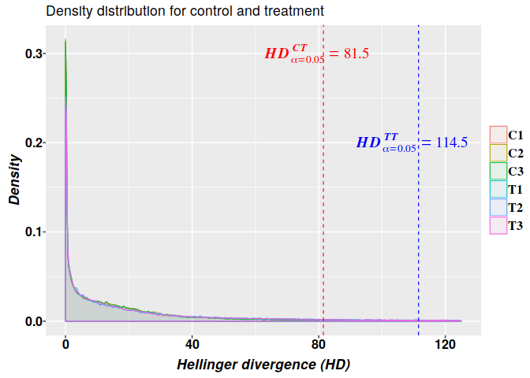
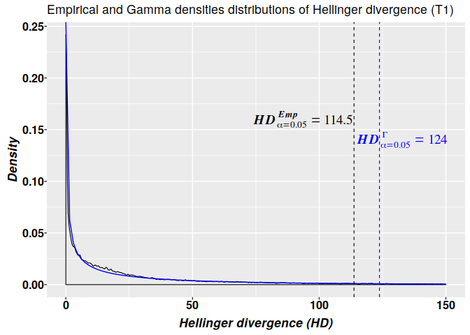

<style type="text/css">

body{ /* Normal  */
      font-size: 18px;
      font-family: "Times New Roman", Times, serif;
      text-align: justify
  }
td {  /* Table  */
  font-size: 8px;
}

h1.title {
  font-size: 38px;
  font-family: "Times New Roman", Times, serif;
  color: DarkRed;
  .subTitle {
  font-size: 24px;
  font-family: "Times New Roman", Times, serif;
  color: DarkRed;
  }
}

h1 { /* Header 1 */
  font-size: 28px;
  font-family: "Times New Roman", Times, serif;
  color: DarkBlue;
}
h2 { /* Header 2 */
    font-size: 22px;
    color: DarkBlue;
    font-family: "Times New Roman", Times, serif;
}
h3 { /* Header 3 */
   font-size: 18px;
   color: DarkBlue;
   font-family: "Times New Roman", Times, serif;
}
code.r{ /* Code block */
    font-size: 12px;
}
pre { /* Code block - determines code spacing between lines */
    font-size: 14px;
}
</style>


# Background
  Methyl-IT R package offers a methylome analysis approach based on information
  thermodynamics (IT) and signal detection. Methyl-IT approach confront
  detection of differentially methylated cytosine as a signal detection problem.
  This approach was designed to discriminate methylation regulatory signal from
  background noise induced by molecular stochastic fluctuations. Methyl-IT R
  package is not limited to the IT approach but also includes Fisher's exact
  test (FT), Root-mean-square statistic (RMST) or Hellinger divergence (HDT)
  tests. Herein, we will show that a signal detection step is also required for
  FT, RMST, and HDT as well. It is worthy to notice that, as for any standard
  statistical analysis, any serious robust methylation analysis requires for a
  descriptive statistical analysis at the beginning or at different downstream
  steps. This is an ABC principle taught in any undergraduate course on
  statistics. Methylation analysis is not the exception of the rule. This detail
  is included in this example. 
  
  Note: This example was made with the MethylIT version at https://github.com/genomaths/MethylIT.  
  It must NOT run with the current version available at https://git.psu.edu/genomath/MethylIT
  

# Available datasets and reading
Methylome datasets of whole-genome bisulfite sequencing (WGBS) are available at
Gene Expression Omnibus (GEO DataSets). The data set are downloaded providing
the GEO accession numbers for each data set to the function *getGEOSuppFiles*
(for details type ?getGEOSuppFiles in the R console). Then, datasets can be
read using function *readCounts2GRangesList*. An example on how to load
datasets of read-counts of methylated and unmethylated cytosine into Methyl-IT is
given in the Cancer example at https://git.psu.edu/genomath/MethylIT
(https://git.psu.edu/genomath/MethylIT_data/blob/master/cancer_example_04-03-18.pdf)

# Data generation
For the current example on methylation analysis with Methyl-IT we will use
simulated data. Read-count matrices of methylated and unmethylated cytosine are
generated with Methyl-IT function *simulateCounts*.

Function *simulateCounts* randomly generates prior methylation levels using Beta
distribution function. The expected mean of methylation levels that we would like
to have can be estimated using the auxiliary function:


```r
bmean <- function(alpha, beta) alpha/(alpha + beta)
alpha.ct <- 0.09
alpha.tt <- 0.2
c(control.group = bmean(alpha.ct, 0.5), treatment.group = bmean(alpha.tt, 0.5), 
  mean.diff = bmean(alpha.tt, 0.5) - bmean(alpha.ct, 0.5)) 
```

```
##   control.group treatment.group       mean.diff 
##       0.1525424       0.2857143       0.1331719
```

This simple function uses the $\alpha$ (*shape1*) and $\beta$ (*shape2*) 
parameters from the Beta distribution function to compute the expected value of 
methylation levels. In the current case, we expect to have a difference of 
methylation levels about 0.133 between the control and the treatment.

## Simulation
Methyl-IT function *simulateCounts* will be used to generate the datasets, which 
will include three group of samples: reference, control, and treatment.


```r
library(MethylIT)
library(MethylIT.utils)

# The number of cytosine sites to generate
sites = 50000 
# Set a seed for pseudo-random number generation
set.seed(124)
control.nam <- c("C1", "C2", "C3")
treatment.nam <- c("T1", "T2", "T3")

# Reference group 
ref0 = simulateCounts(num.samples = 4, sites = sites, alpha = alpha.ct, beta = 0.5,
                      size = 50, theta = 4.5, sample.ids = c("R1", "R2", "R3"))
# Control group
ctrl = simulateCounts(num.samples = 3, sites = sites, alpha = alpha.ct, beta = 0.5,
                      size = 50, theta = 4.5, sample.ids = control.nam)
# Treatment group
treat = simulateCounts(num.samples = 3, sites = sites, alpha = alpha.tt, beta = 0.5,
                       size = 50, theta = 4.5, sample.ids = treatment.nam)
```

Notice that reference and control groups of samples are not identical but belong
to the same population.

## Divergences of methylation levels
The estimation of the divergences of methylation levels is required to proceed
with the application of signal detection basic approach. The information
divergence is estimated here using the function *estimateDivergence*. For each
cytosine site, methylation levels are estimated according to the formulas:
$p_i={n_i}^{mC_j}/({n_i}^{mC_j}+{n_i}^{C_j})$, where ${n_i}^{mC_j}$ and
${n_i}^{C_j}$ are the number of methylated and unmethylated cytosines at site 
$i$.

If a Bayesian correction of counts is selected in function *estimateDivergence*,
then methylated read counts are modeled by a beta-binomial distribution in a
Bayesian framework, which accounts for the biological and sampling variations
[@Hebestreit2013; @Robinson2014;
@Dolzhenko2014]. In our case we adopted the Bayesian approach suggested in
reference [@Baldi2001] (Chapter 3).

Two types of information divergences are estimated: *TV*, total variation (*TV*,
absolute value of methylation levels) and Hellinger divergence (*HD*). *TV*
is computed according to the formula: $TV_d=|p_{tt}-p_{ct}|$ and *HD*:

$$H(\hat p_{ij},\hat p_{ir}) = w_i[(\sqrt{\hat p_{ij}} - \sqrt{\hat
p_{ir}})^2+(\sqrt{1-\hat p_{ij}} - \sqrt{1-\hat p_{ir}})^2]$$ 


where $w_i = 2 \frac{m_{ij} m_{ir}}{m_{ij} + m_{ir}}$, 
$m_{ij} = {n_i}^{mC_j}+{n_i}^{uC_j}+1$, $m_{ir} = {n_i}^{mC_r}+{n_i}^{uC_r}+1$ 
and $j \in {\{c,t}\}$

The equation for Hellinger divergence is given in reference [@Basu2010], but
any other information theoretical divergences could be used as well.

Divergences are estimated for control and treatment groups in respect to a
virtual sample, which is created applying function *poolFromGRlist* on the
reference group.


```r
# Reference sample
ref = poolFromGRlist(ref0, stat = "mean", num.cores = 4L, verbose = FALSE)

# Methylation level divergences
DIVs <- estimateDivergence(ref = ref, indiv = c(ctrl, treat), Bayesian = TRUE, 
                           num.cores = 6L, percentile = 1, verbose = FALSE)
```

The mean of methylation levels differences is:

```r
unlist(lapply(DIVs, function(x) mean(mcols(x[, 7])[,1])))
```

```
##            C1            C2            C3            T1            T2 
## -0.0009820776 -0.0014922009 -0.0022257725  0.1358867135  0.1359160219 
##            T3 
##  0.1309217360
```

# Methylation signal

Likewise for any other signal in nature, the analysis of methylation signal 
requires for the knowledge of its probability distribution. In the current case, 
the signal is represented in terms of the Hellinger divergence of methylation
levels (*HD*).


```r
divs = DIVs[order(names(DIVs))]

# To remove hd == 0 to estimate. The methylation signal only is given for  
divs = lapply(divs, function(div) div[ abs(div$hdiv) > 0 ], keep.attr = TRUE)
names(divs) <- names(DIVs)

# Data frame with the Hellinger divergences from both groups of samples samples 
l = c(); for (k in 1:length(divs)) l = c(l, length(divs[[k]]))
data <- data.frame(HD = c(abs(divs$C1$hdiv), abs(divs$C2$hdiv), abs(divs$C3$hdiv),
                           abs(divs$T1$hdiv), abs(divs$T2$hdiv), abs(divs$T3$hdiv)),
                   sample = c(rep("C1", l[1]), rep("C2", l[2]), rep("C3", l[3]),
                              rep("T1", l[4]), rep("T2", l[5]), rep("T3", l[6]))
)
```

Empirical critical values for the probability distribution of $HD$ and $TV$ can
be obtained using *quantile* function from the R package *stats*.

```r
critical.val <- do.call(rbind, lapply(divs, function(x) {
  hd.95 = quantile(x$hdiv, 0.95)
  tv.95 = quantile(x$TV, 0.95)
  return(c(tv = tv.95, hd = hd.95))
}))

critical.val
```

```
##       tv.95%    hd.95%
## C1 0.7893927  81.47256
## C2 0.7870469  80.95873
## C3 0.7950869  81.27145
## T1 0.9261629 113.73798
## T2 0.9240506 114.45228
## T3 0.9212163 111.54258
```

The kernel density estimation yields the empirical density shown in the
graphics:


```r
suppressMessages(library(ggplot2))

# Some information for graphic
crit.val.ct <- max(critical.val[c("C1", "C2", "C3"), 2]) # 81.5
crit.val.tt <- min(critical.val[c("T1", "T2", "T3"), 2]) # 111.5426

# Density plot with ggplot
ggplot(data, aes(x = HD, colour = sample, fill = sample)) + 
  geom_density(alpha = 0.05, bw = 0.2, position = "identity", na.rm = TRUE,
               size = 0.4) + xlim(c(0, 125)) +   
  xlab(expression(bolditalic("Hellinger divergence (HD)"))) + 
  ylab(expression(bolditalic("Density"))) +
  ggtitle("Density distribution for control and treatment") +
  geom_vline(xintercept = crit.val.ct, color = "red", linetype = "dashed", size = 0.4) +
  annotate(geom = "text", x = crit.val.ct-2, y = 0.3, size = 5,
           label = 'bolditalic(HD[alpha == 0.05]^CT==81.5)',
           family = "serif", color = "red", parse = TRUE) +
  geom_vline(xintercept = crit.val.tt, color = "blue", linetype = "dashed", size = 0.4) +
  annotate(geom = "text", x = crit.val.tt -2, y = 0.2, size = 5,
           label = 'bolditalic(HD[alpha == 0.05]^TT==114.5)',
           family = "serif", color = "blue", parse = TRUE) +
  theme(
    axis.text.x  = element_text( face = "bold", size = 12, color="black",
                                 margin = margin(1,0,1,0, unit = "pt" )),
    axis.text.y  = element_text( face = "bold", size = 12, color="black", 
                                 margin = margin( 0,0.1,0,0, unit = "mm")),
    axis.title.x = element_text(face = "bold", size = 13,
                                color="black", vjust = 0 ),
    axis.title.y = element_text(face = "bold", size = 13,
                                color="black", vjust = 0 ),
    legend.title = element_blank(),
    legend.margin = margin(c(0.3, 0.3, 0.3, 0.3), unit = 'mm'),
    legend.box.spacing = unit(0.5, "lines"),
    legend.text = element_text(face = "bold", size = 12, family = "serif")
  )
```

<!-- -->

The graphic above shows that with high probability the methylation signal 
induced by the treatment has *HD* values $HD^{TT}_{\alpha=0.05}\geq114.5$. 
According to the critical value estimated for the differences of methylation 
levels, the methylation signal holds $TV^{TT}_{\alpha=0.05}\geq0.926$. 

Notice that most of the methylation changes are not signal but noise (found to
the left of the critical values). This situation is typical for all the natural
and technologically generated signals.

Assuming that the background methylation variation is consistent with a Poisson
process and that methylation changes conform to the second law of
thermodynamics, the Hellinger divergence of methylation levels follows a Weibull
distribution probability or some member of the generalized gamma distribution
family [@Sanchez2016].

## Potential DMPs from the methylation signal using empirical distribution
As suggested from the empirical density graphics (above), the critical values
$HD_{\alpha=0.05}$ and $TV_{\alpha=0.05}$ can be used as cutpoints to select
potential DMPs. After setting $dist.name = "ECDF"$ and $tv.cut = 0.926$ in
Methyl-IT function *getPotentialDIMP*, potential DMPs are estimated using the 
empirical cummulative distribution function (ECDF) and the critical value 
$TV_{\alpha=0.05}=0.926$.


```r
DMP.ecdf <- getPotentialDIMP(LR = divs, div.col = 9L, tv.cut = 0.926, tv.col = 7,
                            alpha = 0.05, dist.name = "ECDF")
```

## Potential DMPs detected with Fisher's exact test
In Methyl-IT, Fisher's exact test (FT) is implemented in function *FisherTest*.
In the current case, a pairwise group application of FT to each cytosine site is
performed. The differences between the group means of read counts of methylated
and unmethylated cytosines at each site are used for testing 
($pooling.stat ="mean"$). Notice that only cytosine sites with critical values
$TV_d>0.926$ are tested (*tv.cut = 0.926*).


```r
ft = FisherTest(LR = divs, tv.cut = 0.926,
                     pAdjustMethod = "BH",  pooling.stat = "mean", 
                     pvalCutOff = 0.05, num.cores = 4L,
                     verbose = FALSE, saveAll = FALSE) 

ft.tv <- getPotentialDIMP(LR = ft, div.col = 9L, dist.name = "None",
                          tv.cut = 0.926, tv.col = 7, alpha = 0.05)
```

The above setting would impose additional constrains on the output 
of DMPs resulting from Fisher's exact test depending on how strong is the
methylation background noise in the control  population. Basically, methylation 
variations that can spontaneously occur in the control population with 
relatively high frequencies are disregarded. The decisions are based on the 
empirical cumulative distribution function (ECDF).

## Potential DMPs detected with Weibull 2-parameters model
Potential DMPs can be estimated using the critical values derived from the
fitted Weibull 2-parameters models, which are obtained after the non-linear fit
of the theoretical model on the genome-wide $HD$ values for each individual
sample using Methyl-IT function *nonlinearFitDist* [@Sanchez2016]. As before,
only cytosine sites with critical values $TV_d>0.926$ are considered DMPs. Notice
that, it is always possible to use any other values of $HD$ and $TV_d$ as critical
values, but whatever could be the value it will affect the final accuracy of the
classification performance of DMPs into two groups, DMPs from control and DNPs 
from treatment (see below). So, it is important to do an good choices of the 
critical values.


```r
nlms.wb <- nonlinearFitDist(divs, column = 9L, verbose = FALSE, num.cores = 6L)
# Potential DMPs from 'Weibull2P' model
DMPs.wb <- getPotentialDIMP(LR = divs, nlms = nlms.wb, div.col = 9L, 
                            tv.cut = 0.926, tv.col = 7, alpha = 0.05, 
                            dist.name = "Weibull2P")
nlms.wb$T1 
```

```
##         Estimate   Std. Error  t value Pr(>|t|))      Adj.R.Square
## shape  0.5413711 0.0003964435 1365.570         0 0.991666592250838
## scale 19.4097502 0.0155797315 1245.833         0                  
##                     rho       R.Cross.val              DEV
## shape 0.991666258901194 0.996595722235241 34.7217494754823
## scale                                                     
##                     AIC               BIC     COV.shape     COV.scale
## shape -221720.747067975 -221694.287733122  1.571674e-07 -1.165129e-06
## scale                                     -1.165129e-06  2.427280e-04
##       COV.mu     n
## shape     NA 50000
## scale     NA 50000
```

## Potential DMPs detected with Gamma 2-parameters model
As in the case of Weibull 2-parameters model, potential DMPs can be estimated 
using the critical values derived from the fitted Gamma 2-parameters models and
only cytosine sites with critical values $TV_d>0.926$ are considered DMPs.


```r
nlms.g2p <- nonlinearFitDist(divs, column = 9L, verbose = FALSE, num.cores = 6L,
                            dist.name = "Gamma2P")
# Potential DMPs from 'Gamma2P' model
DMPs.g2p <- getPotentialDIMP(LR = divs, nlms = nlms.g2p,  div.col = 9L, 
                             tv.cut = 0.926, tv.col = 7, alpha = 0.05, 
                             dist.name = "Gamma2P")
nlms.g2p$T1
```

```
##         Estimate   Std. Error  t value Pr(>|t|))      Adj.R.Square
## shape  0.3866249 0.0001480347 2611.717         0 0.999998194156282
## scale 76.1580083 0.0642929555 1184.547         0                  
##                     rho       R.Cross.val                 DEV
## shape 0.999998194084045 0.998331895911125 0.00752417919133131
## scale                                                        
##                    AIC               BIC     COV.alpha     COV.scale
## shape -265404.29138371 -265369.012270572  2.191429e-08 -8.581717e-06
## scale                                    -8.581717e-06  4.133584e-03
##       COV.mu    df
## shape     NA 49998
## scale     NA 49998
```
## Potential DMPs detected with Fisher's exact test and Gamma2P critical value
There is not a one-to-one mapping between $TV_d$ and $HD$. However, at each
cytosine site $i$, these information divergences hold the inequality:
$TV_d(p^{tt}_i,p^{ct}_i)\leq \frac{2}{\sqrt{2w_i}}\sqrt{HD(p^{tt}_i,p^{ct}_i)}$

The critical values for the model Gamma2P can be retrived using:


```r
unlist(lapply(nlms.g2p, function(model) {
   shape <- model$Estimate[1]
   scale <- model$Estimate[2]
   return(qgamma(0.95, shape = shape, scale = scale))
}))
```

```
##        C1        C2        C3        T1        T2        T3 
##  97.40329  97.19037  96.98129 123.78138 123.55315 120.30413
```


So, potential DMPs detected with FT can be constrained with the critical value
$HD^{TT}_{\alpha=0.05}\geq120.3$ [@Steerneman1983]:


```r
# Potential DMPs from Fisher's exact test 
ft.hd <- getPotentialDIMP(LR = ft, div.col = 9L, hdiv.col = 9L, hdiv.cut = 120.3,
                          tv.cut = 0.926, tv.col = 7, alpha = 0.05, dist.name = "None")
```


Summary table:

```r
data.frame(ft = unlist(lapply(ft.tv, length)), ft.hd = unlist(lapply(ft.hd, length)),
ecdf = unlist(lapply(DMP.ecdf, length)), Weibull = unlist(lapply(DMPs.wb, length)),
Gamma = unlist(lapply(DMPs.g2p, length)))
```

```
##      ft ft.hd ecdf Weibull Gamma
## C1 1253   726   63     756   935
## C2 1221   724   62     755   925
## C3 1280   733   64     768   947
## T1 2504  1429  126     924  1346
## T2 2464  1439  124     942  1379
## T3 2408  1354  121     979  1354
```
Notice that there are significant differences between the numbers of DMPs detected by 
Fisher's exact test  (FT) and other approaches. There at least about 2408 - 1354 = 1054 DMPs
in the treatment samples that are not induced by the treatment, which can naturally
occurs in both groups, control and treatment. In other words, the theoretical probabilistic
models of Weibull and Gamma distributions are used to describe those methylation 
events resultant of the normal (non-stressful) biological processes. Any information divergence
of methylation level below the critical value $TV_{\alpha=0.05}$ or $HD_{\alpha=0.05}$ is
a methylation event that can occur in normal conditions. *It does not matter how much significant* 
*a test like FT could be, since it is not about the signification of the test, but about* 
*how big is the probability to observe that methylation event in the control population*. 

## Critical values based on fitted models
Critical values $HD_{\alpha=0.05}$ can be estimated from each fitted model using
*predict* function:


```r
crit.wb = predict(nlms.wb, pred = "quant", q = 0.95, dist.name = "Weibull2P")
crit.g2p = predict(nlms.g2p, pred = "quant", q = 0.95, dist.name = "Gamma2P")

data.frame(wb = do.call(rbind, crit.wb), g2p = do.call(rbind, crit.g2p))
```

```
##          wb       g2p
## C1 117.1289  97.40329
## C2 117.4248  97.19037
## C3 116.8375  96.98129
## T1 147.2984 123.78138
## T2 147.3413 123.55315
## T3 142.6252 120.30413
```

The graphics for the empirical (in black) and Gamma (in blue) densities
distributions of Hellinger divergence of methylation levels for sample T1 are
shown below. The 2-parameter gamma model is build by using the parameters
estimated in the non-linear fit of $HD$ values from sample T1. The critical
values estimated from the 2-parameter gamma distribution
$HD^{\Gamma}_{\alpha=0.05}=123.78$ is more 'conservative' than the critical value
based on the empirical distribution $HD^{Emp}_{\alpha=0.05}=114.5$. That is, 
in accordance with the empirical distribution, for a methylation change to be 
considered a signal its $HD$ value must be $HD\geq114.5$, while according with
the 2-parameter gamma model any cytosine carrying a signal must hold 
$HD\geq124$. 


```r
suppressMessages(library(ggplot2))

# Some information for graphic
dt <- data[data$sample == "T1", ]
coef <- nlms.g2p$T1$Estimate # Coefficients from the non-linear fit
dgamma2p <- function(x) dgamma(x, shape = coef[1], scale = coef[2])
qgamma2p <- function(x) qgamma(x, shape = coef[1], scale = coef[2])

# 95% quantiles 
q95 <- qgamma2p(0.95) # Gamma model based quantile
emp.q95 = quantile(divs$T1$hdiv, 0.95) # Empirical quantile

# Density plot with ggplot
ggplot(dt, aes(x = HD)) + 
  geom_density(alpha = 0.05, bw = 0.2, position = "identity", na.rm = TRUE,
               size = 0.4) + xlim(c(0, 150)) +
  stat_function(fun = dgamma2p, colour = "blue") +
  xlab(expression(bolditalic("Hellinger divergence (HD)"))) + 
  ylab(expression(bolditalic("Density"))) +
  ggtitle("Empirical and Gamma densities distributions of Hellinger divergence (T1)") +
  geom_vline(xintercept = emp.q95, color = "black", linetype = "dashed", size = 0.4) +
  annotate(geom = "text", x = emp.q95 - 20, y = 0.16, size = 5,
           label = 'bolditalic(HD[alpha == 0.05]^Emp==114.5)',
           family = "serif", color = "black", parse = TRUE) +
  geom_vline(xintercept = q95, color = "blue", linetype = "dashed", size = 0.4) +
  annotate(geom = "text", x = q95 + 9, y = 0.14, size = 5,
           label = 'bolditalic(HD[alpha == 0.05]^Gamma==124)',
           family = "serif", color = "blue", parse = TRUE) +
  theme(
    axis.text.x  = element_text( face = "bold", size = 12, color="black",
                                 margin = margin(1,0,1,0, unit = "pt" )),
    axis.text.y  = element_text( face = "bold", size = 12, color="black", 
                                 margin = margin( 0,0.1,0,0, unit = "mm")),
    axis.title.x = element_text(face = "bold", size = 13,
                                color="black", vjust = 0 ),
    axis.title.y = element_text(face = "bold", size = 13,
                                color="black", vjust = 0 ),
    legend.title = element_blank(),
    legend.margin = margin(c(0.3, 0.3, 0.3, 0.3), unit = 'mm'),
    legend.box.spacing = unit(0.5, "lines"),
    legend.text = element_text(face = "bold", size = 12, family = "serif")
  )
```

<!-- -->

# Cutpoint for the spontaneous variability in the control group 
Normally, there is a spontaneous variability in the control group. This is a
consequence of the random fluctuations, or noise, inherent to the methylation
process. The stochasticity of the the methylation process is derives from the
stochasticity inherent in biochemical processes. There are fundamental physical
reasons to acknowledge that biochemical processes are subject to noise and
fluctuations [@Samoilov2006; @Eldar2010]. So, regardless constant environment,
statistically significant methylation changes can be found in control population
with probability greater than zero and proportional to a Boltzmann factor
[@Sanchez2016].

Natural signals and those generated by human technology are not free of noise
and, as mentioned above, the methylation signal is no exception. Only signal
detection based approaches are designed to filter out the signal from the noise,
in natural and in human generated signals.

The need for the application of (what is now known as) signal detection in
cancer research was pointed out by Youden in the midst of the last century
[@Youden1950]. Here, the application of signal detection approach was performed
according with the standard practice in current implementations of clinical
diagnostic test [@Carter2016; @lopez2014; @Hippenstiel2001]. That is, optimal
cutoff values of the methylation signal were estimated on the receiver operating
characteristic curves (ROCs) and applied to identify DMPs. The decision of
whether a DMP detected by Fisher’s exact test (or any other statistical test
implemented in Methyl-IT) is taken based on the optimal cutoff value.

In the current example, the column carrying *TV* (*div.col* = 7L) will be used
to estimate the cutpoint. The column values will be expressed in terms of 
$TV_d=|p_{tt}-p_{ct}|$ (*absolute* = TRUE):

```r
# Cutpoint estimation for FT approach
cut.ft = estimateCutPoint(LR = ft.tv, simple = TRUE, 
                            control.names = control.nam, 
                            treatment.names = treatment.nam,
                            div.col = 7L, verbose = FALSE)

# Cutpoint estimation for the FT approach using the ECDF critical value
cut.ft.hd = estimateCutPoint(LR = ft.hd, simple = TRUE,
                            control.names = control.nam, 
                            treatment.names = treatment.nam,
                            div.col = 7L, verbose = FALSE)

cut.emd = estimateCutPoint(LR = DMP.ecdf, simple = TRUE,
                            control.names = control.nam, 
                            treatment.names = treatment.nam,
                            div.col = 7L, verbose = FALSE)

# Cutpoint estimation for the Weibull 2-parameter distribution approach
cut.wb = estimateCutPoint(LR = DMPs.wb, simple = TRUE,
                            control.names = control.nam, 
                            treatment.names = treatment.nam,
                            div.col = 7L, verbose = FALSE)
# Cutpoint estimation for the Gamma 2-parameter distribution approach
cut.g2p = estimateCutPoint(LR = DMPs.g2p, simple = TRUE,
                            control.names = control.nam, 
                            treatment.names = treatment.nam,
                            div.col = 7L, verbose = FALSE)

# Control cutpoint to define TRUE negatives and TRUE positives
cuts <- data.frame(cut.ft = cut.ft$cutpoint, cut.ft.hd = cut.ft.hd$cutpoint, 
                   cut.ecdf = cut.emd$cutpoint, cut.wb = cut.wb$cutpoint,
                   cut.g2p = cut.g2p$cutpoint)
cuts
```

```
##      cut.ft cut.ft.hd cut.ecdf   cut.wb   cut.g2p
## 1 0.9847716 0.9847716 0.987013 0.988024 0.9847716
```

For all the cases, the classification performance is very poor. However, the
purpose here is to get a first estimation of an estimation of an optimal cutoff
(cutpoint) for the difference of methylation levels (*TV*). It is clear that a
classification of DMPs into DMPs from control and DMPs from treatment can not be
only based on one variable (*TV*). An alternative estimation of the optimal
cutpoint can be obtained with function Methyl-IT *findCutpoint* (not covered
here).

Now, with high probability true DMPs can be selected with Methyl-IT function
*selectDIMP*. 


```r
ft.DMPs <- selectDIMP(ft.tv, div.col = 7L, cutpoint = 0.9847716, absolute = TRUE)
ft.hd.DMPs <- selectDIMP(ft.hd, div.col = 7L, cutpoint = 0.9847716, absolute = TRUE)
emd.DMPs <- selectDIMP(DMP.ecdf, div.col = 7L, cutpoint = 0.9847716, absolute = TRUE)
wb.DMPs <- selectDIMP(DMPs.wb, div.col = 7L, cutpoint = 0.9847716, absolute = TRUE)
g2p.DMPs <- selectDIMP(DMPs.g2p, div.col = 7L, cutpoint = 0.9847716, absolute = TRUE)

data.frame(ft = unlist(lapply(ft.DMPs, length)), ft.hd = unlist(lapply(ft.hd.DMPs, length)),
ecdf = unlist(lapply(DMP.ecdf, length)), Weibull = unlist(lapply(wb.DMPs, length)),
Gamma = unlist(lapply(g2p.DMPs, length)))
```

```
##      ft ft.hd ecdf Weibull Gamma
## C1  622   403   63     416   487
## C2  616   422   62     430   497
## C3  644   421   64     432   508
## T1 1300   842  126     588   803
## T2 1278   824  124     591   794
## T3 1271   827  121     633   827
```

Nevertheless, we should evaluate the classification performance as given in the
next section.

# Evaluation of DMP classification
As shown above, DMPs are found in the control population as well. Hence, it is
important to know whether a DMP is the resulting effect of the treatment or just
spontaneously occurred in the control sample as well. In particular, the
confrontation of this issue is extremely important when methylation analysis is
intended to be used as part of a diagnostic clinical test and a decision making
in biotechnology industry.

Methyl-IT function \code{\link[MethylIT]{evaluateDIMPclass}} is used here, to
evaluate the classification of DMPs into one of the two classes, control and
treatment. Several classifiers are available to be used with this function (see
the help/manual for this function or type ?evaluateDIMPclass in command line).

To evaluate the classification performances, for each methylation analysis
approach, we show the results with the best available classifier. Here, the best
results were found with a logistic model and a quadratic discriminant analysis
(QDA) based on principal component (PC).

## Evaluation of Fisher's exact test DMP classification

```r
ft.class = evaluateDIMPclass(LR = ft.DMPs, control.names = control.nam,
                           treatment.names = treatment.nam,
                           column = c(hdiv = TRUE, TV = TRUE, 
                                      wprob = TRUE, pos = TRUE),
                           classifier = "logistic", interaction = "wprob:TV", 
                           n.pc = 4, pval.col = 11L, center = TRUE, 
                           scale = TRUE, output = "conf.mat", prop = 0.6
)
```

```
## Model: treat ~ hdiv + TV + logP + pos + TV:logP
```

```r
ft.class
```

```
## $Performance
## Confusion Matrix and Statistics
## 
##           Reference
## Prediction   CT   TT
##         CT  135   29
##         TT  618 1511
##                                           
##                Accuracy : 0.7178          
##                  95% CI : (0.6989, 0.7362)
##     No Information Rate : 0.6716          
##     P-Value [Acc > NIR] : 1.015e-06       
##                                           
##                   Kappa : 0.2005          
##  Mcnemar's Test P-Value : < 2.2e-16       
##                                           
##             Sensitivity : 0.9812          
##             Specificity : 0.1793          
##          Pos Pred Value : 0.7097          
##          Neg Pred Value : 0.8232          
##              Prevalence : 0.6716          
##          Detection Rate : 0.6590          
##    Detection Prevalence : 0.9285          
##       Balanced Accuracy : 0.5802          
##                                           
##        'Positive' Class : TT              
##                                           
## 
## $FDR
## [1] 0.2902771
## 
## $model
## 
## Call:  glm(formula = formula, family = binomial(link = "logit"), data = dt)
## 
## Coefficients:
## (Intercept)         hdiv           TV         logP          pos  
##   4.199e+01   -1.451e-01   -4.367e+01    1.092e+00   -6.602e-04  
##     TV:logP  
##  -1.546e+00  
## 
## Degrees of Freedom: 3437 Total (i.e. Null);  3432 Residual
## Null Deviance:	    4353 
## Residual Deviance: 4067 	AIC: 4079
```


## Evaluation DMP classification derived from Fisher's exact test and ECDF critical value 

```r
ft.hd.class = evaluateDIMPclass(LR = ft.hd.DMPs, control.names = control.nam,
                           treatment.names = treatment.nam,
                           column = c(hdiv = TRUE, TV = TRUE, 
                                      wprob = TRUE, pos = TRUE),
                           classifier = "logistic", interaction = "wprob:TV", 
                           n.pc = 4, pval.col = 11L, center = TRUE, 
                           scale = TRUE, output = "conf.mat", prop = 0.6
)
```

```
## Model: treat ~ hdiv + TV + logP + pos + TV:logP
```

```r
ft.hd.class
```

```
## $Performance
## Confusion Matrix and Statistics
## 
##           Reference
## Prediction  CT  TT
##         CT 174  18
##         TT 325 980
##                                          
##                Accuracy : 0.7709         
##                  95% CI : (0.7487, 0.792)
##     No Information Rate : 0.6667         
##     P-Value [Acc > NIR] : < 2.2e-16      
##                                          
##                   Kappa : 0.3908         
##  Mcnemar's Test P-Value : < 2.2e-16      
##                                          
##             Sensitivity : 0.9820         
##             Specificity : 0.3487         
##          Pos Pred Value : 0.7510         
##          Neg Pred Value : 0.9062         
##              Prevalence : 0.6667         
##          Detection Rate : 0.6546         
##    Detection Prevalence : 0.8717         
##       Balanced Accuracy : 0.6653         
##                                          
##        'Positive' Class : TT             
##                                          
## 
## $FDR
## [1] 0.2490421
## 
## $model
## 
## Call:  glm(formula = formula, family = binomial(link = "logit"), data = dt)
## 
## Coefficients:
## (Intercept)         hdiv           TV         logP          pos  
##    229.1917      -0.1727    -232.0026       4.4204       0.1808  
##     TV:logP  
##     -4.9700  
## 
## Degrees of Freedom: 2241 Total (i.e. Null);  2236 Residual
## Null Deviance:	    2854 
## Residual Deviance: 2610 	AIC: 2622
```

## Evaluation ECDF based DMP classification

```r
ecdf.class = evaluateDIMPclass(LR = DMP.ecdf, control.names = control.nam,
                           treatment.names = treatment.nam,
                           column = c(hdiv = TRUE, TV = TRUE, 
                                      wprob = TRUE, pos = TRUE),
                           classifier = "pca.qda", n.pc = 4, pval.col = 10L,
                           center = TRUE, scale = TRUE,
                           output = "conf.mat", prop = 0.6
)
```

```
## Model: treat ~ hdiv + TV + logP + pos
```

```r
ecdf.class
```

```
## $Performance
## Confusion Matrix and Statistics
## 
##           Reference
## Prediction  CT  TT
##         CT  72 145
##         TT   4   4
##                                           
##                Accuracy : 0.3378          
##                  95% CI : (0.2763, 0.4036)
##     No Information Rate : 0.6622          
##     P-Value [Acc > NIR] : 1               
##                                           
##                   Kappa : -0.0177         
##  Mcnemar's Test P-Value : <2e-16          
##                                           
##             Sensitivity : 0.02685         
##             Specificity : 0.94737         
##          Pos Pred Value : 0.50000         
##          Neg Pred Value : 0.33180         
##              Prevalence : 0.66222         
##          Detection Rate : 0.01778         
##    Detection Prevalence : 0.03556         
##       Balanced Accuracy : 0.48711         
##                                           
##        'Positive' Class : TT              
##                                           
## 
## $FDR
## [1] 0.5
## 
## $model
## $qda
## Call:
## qda(ind.coord, grouping = data[resp][, 1], tol = tol, method = method)
## 
## Prior probabilities of groups:
##        CT        TT 
## 0.3373134 0.6626866 
## 
## Group means:
##             PC1         PC2         PC3         PC4
## CT  0.013261015  0.06134001  0.04739951 -0.09566950
## TT -0.006749976 -0.03122262 -0.02412678  0.04869664
## 
## $pca
## Standard deviations (1, .., p=4):
## [1] 1.1635497 1.0098710 0.9744562 0.8226468
## 
## Rotation (n x k) = (4 x 4):
##             PC1        PC2        PC3        PC4
## hdiv -0.6692087  0.2408009  0.0214317 -0.7026488
## TV   -0.3430242 -0.4422200  0.8043031  0.1996806
## logP  0.6439784 -0.1703322  0.3451435 -0.6611768
## pos  -0.1406627 -0.8470202 -0.4832319 -0.1710485
## 
## attr(,"class")
## [1] "pcaQDA"
```


## Evaluation of Weibull based DMP classification

```r
ws.class = evaluateDIMPclass(LR = wb.DMPs, control.names = control.nam,
                           treatment.names = treatment.nam,
                           column = c(hdiv = TRUE, TV = TRUE, 
                                      wprob = TRUE, pos = TRUE),
                           classifier = "pca.qda", n.pc = 4,  pval.col = 10L,
                           center = TRUE, scale = TRUE,
                           output = "conf.mat", prop = 0.6
)
```

```
## Model: treat ~ hdiv + TV + logP + pos
```

```r
ws.class
```

```
## $Performance
## Confusion Matrix and Statistics
## 
##           Reference
## Prediction  CT  TT
##         CT 512   0
##         TT   0 725
##                                     
##                Accuracy : 1         
##                  95% CI : (0.997, 1)
##     No Information Rate : 0.5861    
##     P-Value [Acc > NIR] : < 2.2e-16 
##                                     
##                   Kappa : 1         
##  Mcnemar's Test P-Value : NA        
##                                     
##             Sensitivity : 1.0000    
##             Specificity : 1.0000    
##          Pos Pred Value : 1.0000    
##          Neg Pred Value : 1.0000    
##              Prevalence : 0.5861    
##          Detection Rate : 0.5861    
##    Detection Prevalence : 0.5861    
##       Balanced Accuracy : 1.0000    
##                                     
##        'Positive' Class : TT        
##                                     
## 
## $FDR
## [1] 0
## 
## $model
## $qda
## Call:
## qda(ind.coord, grouping = data[resp][, 1], tol = tol, method = method)
## 
## Prior probabilities of groups:
##        CT        TT 
## 0.4133837 0.5866163 
## 
## Group means:
##              PC1         PC2         PC3        PC4
## CT  0.0006129907  0.02627154  0.01436693 -0.3379167
## TT -0.0004319696 -0.01851334 -0.01012426  0.2381272
## 
## $pca
## Standard deviations (1, .., p=4):
## [1] 1.3864692 1.0039443 0.9918014 0.2934775
## 
## Rotation (n x k) = (4 x 4):
##              PC1         PC2         PC3           PC4
## hdiv -0.70390059 -0.01853114 -0.06487288  0.7070870321
## TV   -0.08754381  0.61403346  0.78440944  0.0009100769
## logP  0.70393865  0.01695660  0.06446889  0.7071255955
## pos  -0.03647491 -0.78888021  0.61346321 -0.0007020890
## 
## attr(,"class")
## [1] "pcaQDA"
```

## Evaluation of Gamma based DMP classification

```r
g2p.class = evaluateDIMPclass(LR = g2p.DMPs, control.names = control.nam,
                           treatment.names = treatment.nam,
                           column = c(hdiv = TRUE, TV = TRUE, 
                                      wprob = TRUE, pos = TRUE),
                           classifier = "pca.qda", n.pc = 4, pval.col = 10L, 
                           center = TRUE, scale = TRUE,
                           output = "conf.mat", prop = 0.6
)
```

```
## Model: treat ~ hdiv + TV + logP + pos
```

```r
g2p.class
```

```
## $Performance
## Confusion Matrix and Statistics
## 
##           Reference
## Prediction  CT  TT
##         CT 597   0
##         TT   0 970
##                                      
##                Accuracy : 1          
##                  95% CI : (0.9976, 1)
##     No Information Rate : 0.619      
##     P-Value [Acc > NIR] : < 2.2e-16  
##                                      
##                   Kappa : 1          
##  Mcnemar's Test P-Value : NA         
##                                      
##             Sensitivity : 1.000      
##             Specificity : 1.000      
##          Pos Pred Value : 1.000      
##          Neg Pred Value : 1.000      
##              Prevalence : 0.619      
##          Detection Rate : 0.619      
##    Detection Prevalence : 0.619      
##       Balanced Accuracy : 1.000      
##                                      
##        'Positive' Class : TT         
##                                      
## 
## $FDR
## [1] 0
## 
## $model
## $qda
## Call:
## qda(ind.coord, grouping = data[resp][, 1], tol = tol, method = method)
## 
## Prior probabilities of groups:
##        CT        TT 
## 0.3810132 0.6189868 
## 
## Group means:
##            PC1          PC2           PC3        PC4
## CT -0.09825234  0.009217742 -0.0015298812 -0.3376429
## TT  0.06047858 -0.005673919  0.0009417082  0.2078338
## 
## $pca
## Standard deviations (1, .., p=4):
## [1] 1.3934010 1.0005617 0.9910414 0.2741290
## 
## Rotation (n x k) = (4 x 4):
##              PC1         PC2         PC3           PC4
## hdiv -0.70097482 -0.01600430 -0.09106340  0.7071673216
## TV   -0.13109213  0.26685824  0.95477779 -0.0009560507
## logP  0.70085340  0.01201179  0.09357872  0.7070383630
## pos  -0.01592678 -0.96352803  0.26711394 -0.0031966410
## 
## attr(,"class")
## [1] "pcaQDA"
```

## Summary of DMP classification performance
For the current simulated dataset, the best classification performance was
obtained for the approach of DMP detection based on a 2-parameter gamma
probability distribution of the Hellinger divergence of methylation levels. DMPs
from treatment are distinguish from control DMPs with very high accuracy. The
second best approach was obtained for the 2-parameter Weibull probability
distribution model.

# Conclusions Summary
Herein, an illustrative example of methylation analysis with Methyl-IT have been
presented. Whatever could be the statistical test/approach used to identify
DMPs, the analysis with simulated datasets, where the average of methylation
levels in the control samples is relatively high, indicates the need for the
application of signal detection based approaches.

## Concluding remarks
The simplest suggested steps to follow for a methylation analysis with Methyl-IT
are:

\item 1. To estimate a reference virtual sample from a reference group by using
function *poolFromGRlist*. Notice that several statistics are available to
estimate the virtual samples, i.e., *mean*, *median*, *sum*. For experiments
limited by the number of sample, at least, try the estimation of the virtual
sample from the control group. Alternatively, the whole reference group can be 
used in pairwise comparisons with control and treatment groups (computationally
expensive).

\item 2. To estimate information divergence using function *estimateDivergence*

\item 3. To perform the estimation of the cumulative density function of the 
Hellinger divergence of methylation levels using function *nonlinearFitDist*.

\item 4. To get the potential DMPs using function *getPotentialDIMP*.

\item 5. To estimate the optimal cutpoint using function estimateCutPoint.

\item 6. To retrieve DMPs with function *selectDIMP*.

\item 7. To evaluate the classification performance using function 
*evaluateDIMPclass*.

As shown here, alternative analysis is possible by using Fisher's exact test 
(FT). Whether FT would be better than the approach summarized above will depend
on the dataset under study. The approaches with Root Mean Square Test (RMST) and 
Hellinger divergence test (HDT) are also possible with function *rmstGR*. In 
these cases, we can proceed as suggested for FT. In general, RMST and HDT yield 
better results (not discussed here) than FT.

# References 


