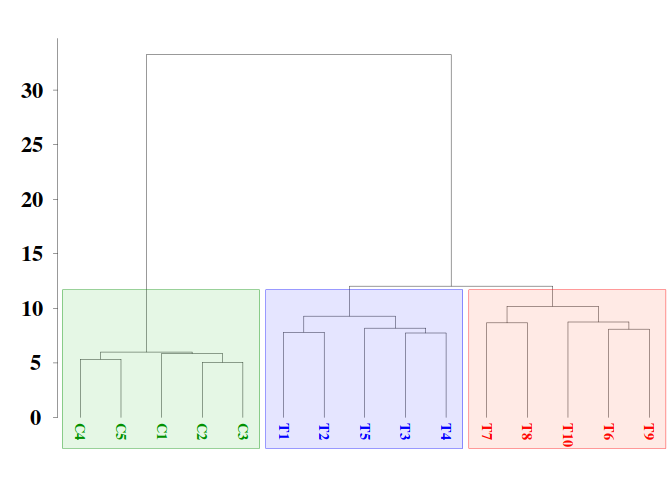
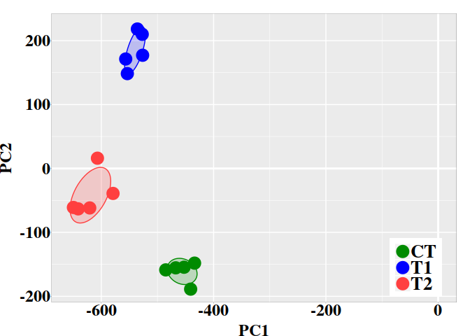
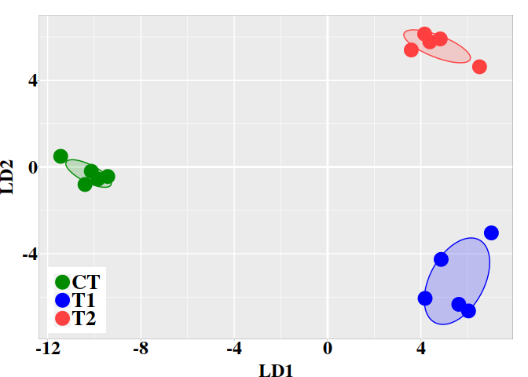

<style type="text/css">

.list-group-item.active, .list-group-item.active:focus, 
.list-group-item.active:hover {
    z-index: 2;
    color: #fff;
    background-color: #337ab7;
    border-color: #337ab7;
}

.tocify-subheader .tocify-item {
  font-size: 0.75em;
  padding-left: 25px;
  text-indent: 0;
}

.tocify-header .tocify-item {
  font-size: 0.8em;
  padding-left: 20px;
  text-indent: 0;
}

body{ /* Normal  */
      font-size: 16px;
      font-family: "Times New Roman", Times, serif;
      text-align: justify
  }
td {  /* Table  */
  font-size: 8px;
}

h1.title {
   font-size: 36px;
   font-family: "Times New Roman", Times, serif;
   color: DarkRed;
   .subTitle {
       font-size: 24px;
       font-family: "Times New Roman", Times, serif;
       color: DarkRed;
  }
}

h1 { /* Header 1 */
  font-size: 24px;
  font-family: "Times New Roman", Times, serif;
  color: DarkBlue;
}
h2 { /* Header 2 */
    font-size: 22px;
    color: DarkBlue;
    font-family: "Times New Roman", Times, serif;
}
h3 { /* Header 3 */
   font-size: 18px;
   color: DarkBlue;
   font-family: "Times New Roman", Times, serif;
}
code.r{ /* Code block */
    font-size: 12px;
}
pre { /* Code block - determines code spacing between lines */
    font-size: 14px;
}
</style>


# Background

The discrimination of the methylation signal from the stochastic methylation
background resultant from the standard (non-stressful) biological processes is a
critical step for the genome-wide methylation analysis. Such a discrimination
requires for the knowledge of the probability distribution of the information
divergence of methylation levels and a proper evaluation of the classification
performance of differentially methylated positions (DMPs) into two classes: DMPs
from control and DMPs from treatment.


Once a methylation analysis is performed to detect the genome-wide DMPs, a
natural next step is to investigate whether the detected DMPs carries enough
discriminatory power to discern between individual groups. Then, we must move
from the methylation analysis to statistical/machine learning field
(multivariate statistics). To reach our goal, each individual can be represented
as a vector from the $N$-dimensional space of DMPs, where DMPs can be expressed
in terms of some suitable measurement as function of the methylation levels.
These suitable measurement are information divergences, such as total variation
distance ($TV_d$, the absolute value of methylation levels) and Hellinger
divergence ($H$). It is worthy to observe that methylation levels are
uncertainty measurements and, therefore, they do not carry information per se.
Information is only carried on measurements expressing uncertainty variations
like $TV_d$, $H$, Jensen-Shannon Divergence, and in general, the so called
information theoretical divergences [@Liese2006].


The $N$-dimensional space of DMPs is, usually, too big. So, a first dimension
reduction is required. This can be done by splitting the chromosomes into
non-overlapping genomic region and next computing some statistic like the *sum*
or *mean* of some information divergences of methylation levels at DMPs inside
of each region. Still we will have to deal with a multidimensional space, but
acceptable for a meaningful application of hierarchical clustering (HC),
principal component analysis (PCA) and linear discriminant analysis (LDA). In
the current examples, Methyl-IT methylation analysis will be applied to a
dataset of simulated samples to detect DMPs on then. Next, after space dimension
reduction, the mentioned machine learning approached will be applied.


Note: This example was made with the MethylIT version 0.3.2
  
# Data generation
For the current example on methylation analysis with Methyl-IT we will use
simulated data. Read-count matrices of methylated and unmethylated cytosine are
generated with MethylIT.utils function [simulateCounts](https://genomaths.github.io/MethylIT_utils_HTML_Manual/simulateCounts.html). 
A basic example generating datasets is given in the web page:
[Methylation analysis with Methyl-IT](https://genomaths.github.io/Methylation_analysis_with_Methyl-IT.html)


```r
library(MethylIT)
library(MethylIT.utils)
library(ggplot2)
library(ape)

alpha.ct <- 0.01
alpha.g1 <- 0.021
alpha.g2 <- 0.025

# The number of cytosine sites to generate
sites = 50000 
# Set a seed for pseudo-random number generation
set.seed(124)
control.nam <- c("C1", "C2", "C3", "C4", "C5")
treatment.nam1 <- c("T1", "T2", "T3", "T4", "T5")
treatment.nam2 <- c("T6", "T7", "T8", "T9", "T10")

# Reference group 
ref0 = simulateCounts(num.samples = 3, sites = sites, alpha = alpha.ct, beta = 0.5,
                      size = 50, theta = 4.5, sample.ids = c("R1", "R2", "R3"))
# Control group 
ctrl = simulateCounts(num.samples = 5, sites = sites, alpha = alpha.ct, beta = 0.5,
                      size = 50, theta = 4.5, sample.ids = control.nam)
# Treatment group II
treat = simulateCounts(num.samples = 5, sites = sites, alpha = alpha.g1, beta = 0.5,
                       size = 50, theta = 4.5, sample.ids = treatment.nam1)

# Treatment group II
treat2 = simulateCounts(num.samples = 5, sites = sites, alpha = alpha.g2, beta = 0.5,
                        size = 50, theta = 4.5, sample.ids = treatment.nam2)
```

A reference sample (virtual individual) is created using individual samples from
the control population using function
[poolFromGRlist](https://genomaths.github.io/MethylIT_HTML_Manual/poolFromGRlist.html).
The reference sample is further used to compute the information divergences of
methylation levels, $TV_d$ and $H$, with function
[estimateDivergence](https://genomaths.github.io/MethylIT_HTML_Manual/estimateDivergence.html).
This is a first fundamental step to remove the background noise (fluctuations)
generated by the inherent stochasticity of the molecular processes in the cells.


```r
# === Methylation level divergences ===
# Reference sample
ref = poolFromGRlist(ref0, stat = "mean", num.cores = 4L, verbose = FALSE)

divs <- estimateDivergence(ref = ref, indiv = c(ctrl, treat, treat2), Bayesian = TRUE, 
                           num.cores = 6L, percentile = 1, verbose = FALSE)

# To remove hd == 0 to estimate. The methylation signal only is given for  
divs = lapply(divs, function(div) div[ abs(div$hdiv) > 0 ], keep.attr = TRUE)
names(divs) <- names(divs)
```

To get some statistical description about the sample is useful. Here, empirical
critical values for the probability distribution of $H$ and $TV$ can is obtained
using *quantile* function from the R package *stats*.


```r
critical.val <- do.call(rbind, lapply(divs, function(x) {
  x <- x[x$hdiv > 0]
  hd.95 = quantile(x$hdiv, 0.95)
  tv.95 = quantile(abs(x$TV), 0.95)
  return(c(tv = tv.95, hd = hd.95))
}))
critical.val
```

```
##        tv.95%   hd.95%
## C1  0.2987088 21.92020
## C2  0.2916667 21.49660
## C3  0.2950820 21.71066
## C4  0.2985075 21.98416
## C5  0.3000000 22.04791
## T1  0.3376711 33.51223
## T2  0.3380282 33.00639
## T3  0.3387097 33.40514
## T4  0.3354077 31.95119
## T5  0.3402172 33.97772
## T6  0.4090909 38.05364
## T7  0.4210526 38.21258
## T8  0.4265781 38.78041
## T9  0.4084507 37.86892
## T10 0.4259411 38.60706
```

# Modeling the methylation signal
Here, the methylation signal is expressed in terms of Hellinger divergence of
methylation levels. Here, the signal distribution is modelled by a Weibull
probability distribution model. Basically, the model could be a member of the
generalized gamma distribution family. For example, it could be gamma
distribution, Weibull, or log-normal. To describe the signal, we may prefer a
model with a cross-validations: R.Cross.val > 0.95. Cross-validations for the
nonlinear regressions are performed in each methylome as described in
[@Stevens2009]. The non-linear fit is performed through the function
[nonlinearFitDist](https://genomaths.github.io/MethylIT_HTML_Manual/nonlinearFitDist.html)


```r
# Potential DMPs estimated with Weibull distribution model. Parameter dist.name
# is set dist.name = "Weibull" and, in this case, the best fitted model, a 
# 2-parameters (2P) or a 3P model, will be reported.
nlms.wb <- nonlinearFitDist(divs, column = 9L, verbose = FALSE, num.cores = 6L,
                            dist.name = "Weibull")
nlms.wb$T1
```

```
##         Estimate   Std. Error  t value Pr(>|t|))      Adj.R.Square
## shape 0.51716858 8.119734e-04 636.9280         0 0.970656620966604
## scale 0.03409413 6.695789e-05 509.1876         0                  
##                    rho       R.Cross.val              DEV
## shape 0.97065544718449 0.991728694533984 122.254748252602
## scale                                                    
##                     AIC               BIC     COV.shape     COV.scale
## shape -158783.712494407 -158757.253159554  6.593008e-07 -2.791813e-08
## scale                                     -2.791813e-08  4.483360e-09
##       COV.mu     n
## shape     NA 50000
## scale     NA 50000
```
# Estimation of an optimal cutpoint to discriminate the signal induced by the treatment

The above statistical description of the dataset (evidently) suggests that there
two main groups: control and treatments, while treatment group would split into
two subgroups of samples. In the current case, to search for a good cutpoint, we
do not need to use all the samples. The critical value
$H_{\alpha=0.05}=33.51223$ suggests that any optimal cutpoint for the subset of
samples T1 to T5 will be optimal for the samples T6 to T10 as well.


Below, we are letting the PCA+LDA model classifier to take the decision on
whether a differentially methylated cytosine position is a treatment DMP. To do
it, Methyl-IT function
[getPotentialDIMP](https://genomaths.github.io/MethylIT_HTML_Manual/getPotentialDIMP.html)
is used to get methylation signal probabilities of the oberved $H$ values for
all cytosine site (alpha = 1), in accordance with the 2-parameter Weibull
distribution model. Next, this information will be used to identify DMPs using
Methyl-IT function
[estimateCutPoint](https://genomaths.github.io/MethylIT_HTML_Manual/estimateCutPoint.html).
Cytosine positions with $H$ values above the cutpoint are considered DMPs.
Finally, a PCA + QDA model classifier will be fitted to classify DMPs into two
classes: DMPs from control and those from treatment. Here, we fundamentally rely
on a relatively strong *tv.cut*= 0.34 and on the signal probability distribution
(*nlms.wb*) model.


```r
dmps.wb <- getPotentialDIMP(LR = divs[1:10],
                             nlms = nlms.wb[1:10],  div.col = 9L, 
                             tv.cut = 0.34, tv.col = 7, alpha = 1, 
                             dist.name = "Weibull2P")
cut.wb = estimateCutPoint(LR = dmps.wb, simple = FALSE,
                            column = c(hdiv = TRUE, TV = TRUE, 
                                       wprob = TRUE, pos = TRUE),
                            classifier1 = "pca.lda", 
                             classifier2 = "pca.qda", tv.cut = 0.34,
                            control.names = control.nam, 
                            treatment.names = treatment.nam1,
                            post.cut = 0.5, cut.values = seq(15, 38, 1),
                            clas.perf = TRUE, prop = 0.6,
                            center = FALSE, scale = FALSE,
                            n.pc = 4, div.col = 9L, stat = 0)
cut.wb
```

```
## Cutpoint estimation with 'pca.lda' classifier 
## Cutpoint search performed using model posterior probabilities 
## 
## Posterior probability used to get the cutpoint = 0.5 
## Cytosine sites with treatment PostProbCut >= 0.5 have a 
## divergence value >= 3.121796 
## 
## Optimized statistic: Accuracy = 1 
## Cutpoint = 37.003 
## 
## Model classifier 'pca.qda' 
## 
## The accessible objects in the output list are: 
##                    Length Class           Mode     
## cutpoint           1      -none-          numeric  
## testSetPerformance 6      confusionMatrix list     
## testSetModel.FDR   1      -none-          numeric  
## model              2      pcaQDA          list     
## modelConfMatrix    6      confusionMatrix list     
## initModel          1      -none-          character
## postProbCut        1      -none-          numeric  
## postCut            1      -none-          numeric  
## classifier         1      -none-          character
## statistic          1      -none-          character
## optStatVal         1      -none-          numeric
```

The cutpoint is higher from what is expected from the higher treatment empirical
critical value: $H_{\alpha = 0.05}^{TT_{Emp}}=33.98 < 37 \le H$.


```r
# Model performance in in the test dataset
cut.wb$testSetPerformance
```

```
## Confusion Matrix and Statistics
## 
##           Reference
## Prediction   CT   TT
##         CT 1960    0
##         TT    0 3874
##                                      
##                Accuracy : 1          
##                  95% CI : (0.9994, 1)
##     No Information Rate : 0.664      
##     P-Value [Acc > NIR] : < 2.2e-16  
##                                      
##                   Kappa : 1          
##  Mcnemar's Test P-Value : NA         
##                                      
##             Sensitivity : 1.000      
##             Specificity : 1.000      
##          Pos Pred Value : 1.000      
##          Neg Pred Value : 1.000      
##              Prevalence : 0.664      
##          Detection Rate : 0.664      
##    Detection Prevalence : 0.664      
##       Balanced Accuracy : 1.000      
##                                      
##        'Positive' Class : TT         
## 
```

```r
# Model performance in in the whole dataset
cut.wb$modelConfMatrix
```

```
## Confusion Matrix and Statistics
## 
##           Reference
## Prediction   CT   TT
##         CT 4897    0
##         TT    2 9685
##                                      
##                Accuracy : 0.9999     
##                  95% CI : (0.9995, 1)
##     No Information Rate : 0.6641     
##     P-Value [Acc > NIR] : <2e-16     
##                                      
##                   Kappa : 0.9997     
##  Mcnemar's Test P-Value : 0.4795     
##                                      
##             Sensitivity : 1.0000     
##             Specificity : 0.9996     
##          Pos Pred Value : 0.9998     
##          Neg Pred Value : 1.0000     
##              Prevalence : 0.6641     
##          Detection Rate : 0.6641     
##    Detection Prevalence : 0.6642     
##       Balanced Accuracy : 0.9998     
##                                      
##        'Positive' Class : TT         
## 
```

```r
# The False discovery rate
cut.wb$testSetModel.FDR
```

```
## [1] 0
```

It is important to search for the best available non-linear fitted model. Readers
can check that a Gamma 2P distribution model ("Gamm2P") will yield a lower classification 
performance.

# Represeting individual samples as vectors from the *N*-dimensional space

The above cutpoint can be used to identify DMPs from control and treatment. The 
PCA+QDA model classifier can be used any time to discriminate control DMPs from
those treatment. DMPs are retrieved using 
[selectDIMP](https://genomaths.github.io/MethylIT_HTML_Manual/selectDIMP.html)
function:


```r
dmps.wb <- selectDIMP(LR = divs, div.col = 9L, cutpoint = 37, tv.cut = 0.34, tv.col = 7)
```

Next, to represent individual samples as vectors from the *N*-dimensional space,
we can use [getGRegionsStat](https://genomaths.github.io/MethylIT_utils_HTML_Manual/getGRegionsStat-methods.html)
function from [MethylIT.utils](https://github.com/genomaths/MethylIT.utils)
R package. Here, the simulated "chromosome" is split into regions of 100bp non-overlapping windows.
and the *mean* of Hellinger divergences values is taken for each windows.


```r
ns <- names(dmps.wb)
DMRs <- getGRegionsStat(GR = dmps.wb, win.size = 100, step.size = 100, stat = "mean",
                        column = 9L)
names(DMRs) <- ns
```

# Hierarchical Clustering

Hierarchical clustering (HC) is an unsupervised machine learning approach. HC
can provide an initial estimation of the number of possible groups and
information on their members. However, the effectivity of HC will depend on the
experimental dataset, the metric used, and the glomeration algorithm applied.
For an unknown reason (and based on the personal experience of the author working
in numerical taxonomy), Ward’s agglomeration algorithm performs much better on
biological experimental datasets than the rest of the available algorithms like
UPGMA, UPGMC, etc.


```r
dmgm <- uniqueGRanges(DMRs, verbose = FALSE)
dmgm <- t(as.matrix(mcols(dmgm)))
rownames(dmgm) <- ns
sampleNames <- ns

hc = hclust(dist(data.frame( dmgm ))^2, method = 'ward.D')
hc.rsq = hc
hc.rsq$height <- sqrt( hc$height )
```

## Dendrogram

```r
colors = sampleNames 
colors[grep("C", colors)] <- "green4"
colors[grep("T[6-9]{1}", colors)] <- "red"
colors[grep("T10", colors)] <- "red"
colors[grep("T[1-5]", colors)] <- "blue"

# rgb(red, green, blue, alpha, names = NULL, maxColorValue = 1)
clusters.color = c(rgb(0, 0.7, 0, 0.1), rgb(0, 0, 1, 0.1), rgb(1, 0.2, 0, 0.1))

par(font.lab=2,font=3,font.axis=2, mar=c(0,3,2,0), family="serif" , lwd = 0.4)
plot(as.phylo(hc.rsq), tip.color = colors, label.offset = 0.5, font = 2, cex = 0.9,
     edge.width  = 0.4, direction = "downwards", no.margin = FALSE,
     align.tip.label = TRUE, adj = 0)
axisPhylo( 2, las = 1, lwd = 0.4, cex.axis = 1.4, hadj = 0.8, tck = -0.01 )
hclust_rect(hc.rsq, k = 3L, border = c("green4", "blue", "red"), 
            color = clusters.color, cuts = c(0.56, 15, 0.41, 300))
```

<!-- -->

Here, we have use function
[as.phylo](https://www.rdocumentation.org/packages/ape/versions/5.3/topics/as.phylo)
from the R package
[ape](https://www.rdocumentation.org/packages/ape/versions/5.3) for better
dendrogram visualization and function 
[hclust_rect](https://genomaths.github.io/MethylIT_utils_HTML_Manual/hclust_rect.html)
from [MethylIT.utils](https://github.com/genomaths/MethylIT.utils) R package to
draw rectangles with background colors around the branches of a dendrogram
highlighting the corresponding clusters.

# PCA + LDA

MethylIT function [pcaLDA](https://genomaths.github.io/MethylIT_HTML_Manual/pcaLDA.html) will be used to
perform the PCA and PCA + LDA analyses. The function returns a list of two
objects: 1) 'lda': an object of class 'lda' from package 'MASS'. 2) 'pca': an
object of class 'prcomp' from package 'stats'. For information on how to use
these objects see ?lda and ?prcomp. 

Unlike hierarchical clustering (HC), LDA is a supervised machine learning 
approach. So, we must provide a prior classification of the individuals, 
which can be derived, for example, from the HC, or from a previous exploratory
analysis with PCA.


```r
# A prior classification derived from HC
grps <- cutree(hc, k = 3)
grps[grep(1, grps)] <- "CT"
grps[grep(2, grps)] <- "T1"
grps[grep(3, grps)] <- "T2"
grps <- factor(grps)

ld <- pcaLDA(data = data.frame(dmgm), grouping = grps, n.pc = 3, max.pc = 3,
             scale = FALSE, center = FALSE, tol = 1e-6)
summary(ld$pca)
```

```
## Importance of first k=3 (out of 15) components:
##                             PC1       PC2       PC3
## Standard deviation     562.0441 150.85031 128.92293
## Proportion of Variance   0.7823   0.05635   0.04116
## Cumulative Proportion    0.7823   0.83860   0.87976
```
We may retain enough components so that the cumulative percent of
variance accounted for at least 70 to 80%. 

## PCA 

The individual coordinates in the principal components (PCs) are returned by 
function [pcaLDA](https://genomaths.github.io/MethylIT_HTML_Manual/pcaLDA.html).
In the current case, based on the cumulative proportion of variance, the two firsts 
PCs carried about the 84% of the total sample variance and could 
split the sample into meaningful groups.


```r
pca.coord <- ld$pca$x
pca.coord
```

```
##           PC1        PC2           PC3
## C1  -467.4777 -155.44418  133.36673973
## C2  -485.2708 -158.66368  135.80703855
## C3  -452.6720 -154.51060  138.78052335
## C4  -440.9002 -188.78318  111.63772303
## C5  -433.9299 -148.09296  105.20513496
## T1  -527.1712  209.96002   91.19372454
## T2  -535.8078  218.22894   98.87993022
## T3  -556.5780  171.30942    0.07492895
## T4  -526.4649  177.19046  105.64662733
## T5  -553.6787  148.44807   64.67522447
## T6  -649.7650  -60.99579 -145.52704599
## T7  -606.9274   16.09337 -165.93261637
## T8  -620.6386  -61.75814 -161.09813539
## T9  -579.1574  -39.03569 -160.47889217
## T10 -641.2574  -63.21083 -140.77946729
```
## Graphic PC1 vs PC2

Next, the graphic for individual coordinates in the two firsts PCs can 
be easely visualized now:


```r
dt <- data.frame(pca.coord[, 1:2], subgrp = grps)

p0 <- theme(
  axis.text.x  = element_text( face = "bold", size = 18, color="black",
                               # hjust = 0.5, vjust = 0.5, 
                               family = "serif", angle = 0,
                               margin = margin(1,0,1,0, unit = "pt" )),
  axis.text.y  = element_text( face = "bold", size = 18, color="black", 
                               family = "serif",
                               margin = margin( 0,0.1,0,0, unit = "mm" )),
  axis.title.x = element_text(face = "bold", family = "serif", size = 18,
                              color="black", vjust = 0 ),
  axis.title.y = element_text(face = "bold", family = "serif", size = 18,
                              color="black", 
                              margin = margin( 0,2,0,0, unit = "mm" ) ),
  legend.title=element_blank(),
  legend.text = element_text(size = 20, face = "bold", family = "serif"),
  legend.position = c(0.899, 0.12),
  
  panel.border = element_rect(fill=NA, colour = "black",size=0.07),
  panel.grid.minor = element_line(color= "white",size = 0.2),
  axis.ticks = element_line(size = 0.1), axis.ticks.length = unit(0.5, "mm"),
  plot.margin = unit(c(1,1,0,0), "lines")) 

ggplot(dt, aes(x = PC1, y = PC2, colour = grps)) + 
  geom_vline(xintercept = 0, color = "white", size = 1) +
  geom_hline(yintercept = 0, color = "white", size = 1) +
  geom_point(size = 6) +
  scale_color_manual(values = c("green4","blue","brown1")) + 
  stat_ellipse(aes(x = PC1, y = PC2, fill = subgrp), data = dt, type = "norm",
               geom = "polygon", level = 0.5, alpha=0.2, show.legend = FALSE) +
  scale_fill_manual(values = c("green4","blue","brown1")) + p0
```

<!-- -->

## Graphic LD1 vs LD2

In the current case, better resolution is obtained with the linear discriminant
functions, which is based on the three firsts PCs. Notice that the number 
principal components used the LDA step must be lower than the number of 
individuals ($N$) divided by 3: $N/3$.


```r
ind.coord <- predict(ld, newdata = data.frame(dmgm), type = "scores")
dt <- data.frame(ind.coord, subgrp = grps)

p0 <- theme(
  axis.text.x  = element_text( face = "bold", size = 18, color="black",
                               # hjust = 0.5, vjust = 0.5, 
                               family = "serif", angle = 0,
                               margin = margin(1,0,1,0, unit = "pt" )),
  axis.text.y  = element_text( face = "bold", size = 18, color="black", 
                               family = "serif",
                               margin = margin( 0,0.1,0,0, unit = "mm" )),
  axis.title.x = element_text(face = "bold", family = "serif", size = 18,
                              color="black", vjust = 0 ),
  axis.title.y = element_text(face = "bold", family = "serif", size = 18,
                              color="black", 
                              margin = margin( 0,2,0,0, unit = "mm" ) ),
  legend.title=element_blank(),
  legend.text = element_text(size = 20, face = "bold", family = "serif"),
  legend.position = c(0.08, 0.12),
  
  panel.border = element_rect(fill=NA, colour = "black",size=0.07),
  panel.grid.minor = element_line(color= "white",size = 0.2),
  axis.ticks = element_line(size = 0.1), axis.ticks.length = unit(0.5, "mm"),
  plot.margin = unit(c(1,1,0,0), "lines")) 

ggplot(dt, aes(x = LD1, y = LD2, colour = grps)) + 
  geom_vline(xintercept = 0, color = "white", size = 1) +
  geom_hline(yintercept = 0, color = "white", size = 1) +
  geom_point(size = 6) +
  scale_color_manual(values = c("green4","blue","brown1")) + 
  stat_ellipse(aes(x = LD1, y = LD2, fill = subgrp), data = dt, type = "norm",
               geom = "polygon", level = 0.5, alpha=0.2, show.legend = FALSE) +
  scale_fill_manual(values = c("green4","blue","brown1")) + p0
```

<!-- -->

# References


